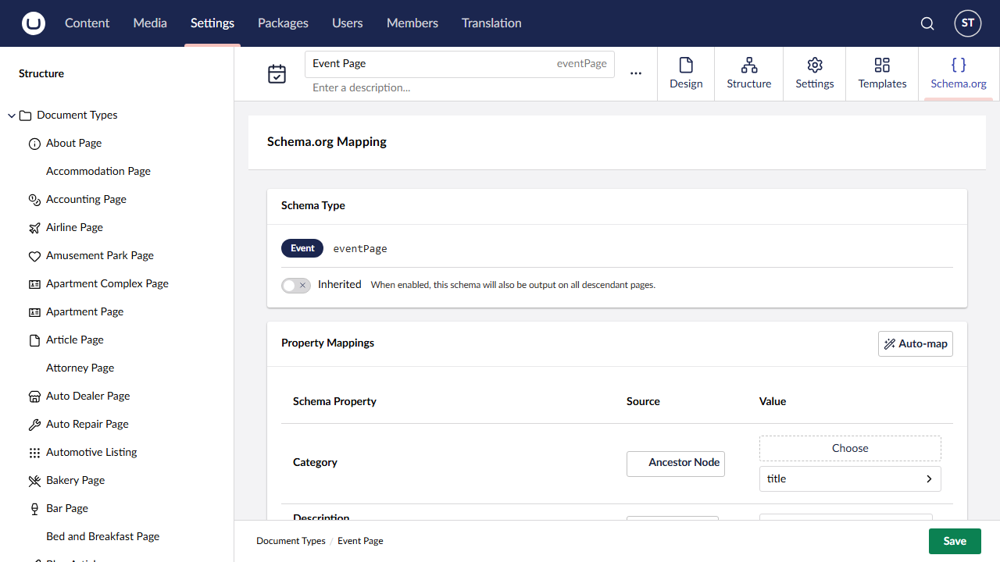
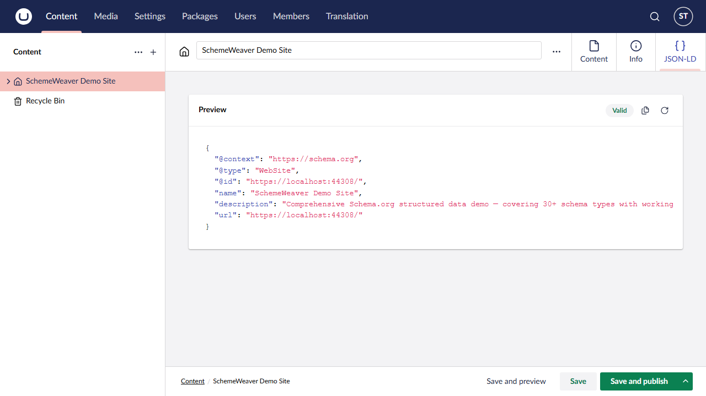

# Advanced Topics

This guide covers SchemeWeaver's deeper features: BreadcrumbList generation, JSON-LD output ordering, the workspace views, custom property resolvers, database schema, and troubleshooting.

## BreadcrumbList Auto-Generation

SchemeWeaver automatically generates a `BreadcrumbList` schema for every page that has at least one ancestor (i.e. is not the root node). This is handled by the `GenerateBreadcrumbJsonLd` method in `JsonLdGenerator`.

### How It Works

1. Starting from the current content node, the generator walks up the parent chain using Umbraco's `IDocumentNavigationQueryService`.
2. The current page is included as the last item in the breadcrumb trail.
3. The list is reversed to root-first order.
4. If the resulting list has fewer than 2 items, no breadcrumb is generated (root nodes have no meaningful trail).

Each `ListItem` in the breadcrumb includes:

| Property | Value |
|---|---|
| `position` | 1-based index (root = 1) |
| `name` | The content node's `Name` property |
| `item` / `@id` | Absolute URL resolved via `IPublishedUrlProvider` |

### Example Output

For a page at **Home > About > Our Team**, the generated BreadcrumbList looks like:

```json
{
  "@context": "https://schema.org",
  "@type": "BreadcrumbList",
  "itemListElement": [
    {
      "@type": "ListItem",
      "position": 1,
      "name": "Home",
      "item": "https://example.com/",
      "@id": "https://example.com/"
    },
    {
      "@type": "ListItem",
      "position": 2,
      "name": "About",
      "item": "https://example.com/about/",
      "@id": "https://example.com/about/"
    },
    {
      "@type": "ListItem",
      "position": 3,
      "name": "Our Team",
      "item": "https://example.com/about/our-team/",
      "@id": "https://example.com/about/our-team/"
    }
  ]
}
```

### Where BreadcrumbList Appears

- **Tag helper** (`<scheme-weaver content="@Model" />`): Included as a separate `<script type="application/ld+json">` block.
- **Delivery API**: NOT included. See the [Delivery API guide](delivery-api.md) for details on why and how to build your own.

## JSON-LD Output Order

When SchemeWeaver renders structured data, multiple JSON-LD blocks may be emitted for a single page. The tag helper and the Delivery API content index handler both follow the same ordering:

1. **Inherited schemas** (root-first) -- schemas from ancestor content types marked as "inherited" (e.g. `WebSite` on the home page, `Organization` on a company node). The ancestor chain is walked from parent upwards, then reversed so the root-level schema appears first.
2. **BreadcrumbList** -- auto-generated breadcrumb trail (tag helper only; excluded from Delivery API).
3. **Main page schema** -- the schema mapped to the current content node's document type.
4. **Block element schemas** -- schemas generated from mapped block elements found in BlockList and BlockGrid properties. Properties that are already explicitly mapped via the `blockContent` source type are excluded to avoid duplication.

Each schema is rendered as its own `<script type="application/ld+json">` block (tag helper) or as a separate string in the `schemaOrg` array (Delivery API).

## Schema.org Workspace View

SchemeWeaver adds a **Schema.org** tab to the document type editor in the Umbraco backoffice. This tab (`schemeweaver-schema-mapping-view`) provides the primary interface for mapping content types to Schema.org types.

### Features

- **Schema type display** -- shows the currently mapped Schema.org type (e.g. `Article`, `Event`) with the content type alias.
- **Inherited toggle** -- a toggle switch that marks the schema as inherited, meaning it will be output on all descendant pages in addition to pages of this content type.
- **Property mapping table** -- an editable table showing mapped Schema.org properties with dropdowns to select the Umbraco property source, source type, and source origin (parent, ancestor, sibling, static, blockContent, complexType). Additional properties can be added via the "Add property" combobox below the table. Individual rows can be removed using the trash icon on hover.
- **Auto-map** -- a button that calls the auto-mapping endpoint to suggest property mappings based on name similarity and type compatibility. Suggestions are merged into the existing table, preserving any manual overrides.
- **Document type save integration** -- persists the mapping to the database when the document type itself is saved via the backoffice.

The workspace view loads the existing mapping on mount by observing the workspace context's `alias` observable, and fetches both the schema properties and the content type properties to populate the dropdowns.



## JSON-LD Content View / Preview

SchemeWeaver adds a **JSON-LD** tab to content nodes (not document types) via the `schemeweaver-jsonld-content-view` workspace view. This tab shows a live preview of the JSON-LD that would be generated for the current content node.

### Two Preview Modes

The preview endpoint (`POST /mappings/{contentTypeAlias}/preview`) supports two modes based on whether a `contentKey` query parameter is provided:

| Mode | Trigger | Behaviour |
|---|---|---|
| **Real preview** | `contentKey` is provided and non-empty | Resolves the published content from the Umbraco content cache and generates actual JSON-LD using the stored mapping and live property values. |
| **Mock preview** | No `contentKey` (or empty) | Generates a mock JSON-LD based on the mapping configuration alone, using placeholder values. Useful when the content has not yet been published. |

### Content View Behaviour

1. On load, the view resolves the content type alias from the workspace context's `contentTypeUnique` observable.
2. It checks whether a schema mapping exists for this content type.
3. If a mapping exists and a content key is available, it requests a real preview.
4. If the content is unpublished (preview returns no data), a warning message is shown indicating that the content must be published first.
5. The preview shows a formatted JSON-LD block with syntax highlighting, a valid/invalid badge, and copy/refresh buttons.



## Extending with Custom Property Resolvers

SchemeWeaver uses an extensible **two-axis resolution** pattern for extracting property values during JSON-LD generation:

- **WHERE axis** -- determines which content node to read from (current page, parent, ancestor, sibling) based on the `SourceType` field.
- **HOW axis** -- determines how to extract the value from the property based on the Umbraco property editor alias, using `IPropertyValueResolver` implementations.

### The IPropertyValueResolver Interface

```csharp
public interface IPropertyValueResolver
{
    /// The Umbraco property editor aliases this resolver handles.
    /// Return empty to act as a fallback resolver.
    IEnumerable<string> SupportedEditorAliases { get; }

    /// Priority for resolver selection when multiple resolvers match.
    /// Higher values take precedence. Default is 0.
    int Priority => 0;

    /// Resolves the property value to a type suitable for Schema.NET.
    object? Resolve(PropertyResolverContext context);
}
```

### PropertyResolverContext

The context object passed to resolvers contains:

| Property | Type | Description |
|---|---|---|
| `Content` | `IPublishedContent` | The content node the property belongs to (already resolved to the correct node by the WHERE axis). |
| `Mapping` | `PropertyMapping` | The property mapping configuration from the database. |
| `PropertyAlias` | `string` | The alias of the property to resolve. |
| `Property` | `IPublishedProperty?` | The raw published property, already located on the correct node. May be null for built-in properties. |
| `SchemaTypeRegistry` | `ISchemaTypeRegistry` | For looking up nested Schema.org types. |
| `MappingRepository` | `ISchemaMappingRepository` | For looking up nested schema mappings. |
| `HttpContextAccessor` | `IHttpContextAccessor` | For resolving absolute URLs from relative paths. |
| `ResolverFactory` | `IPropertyValueResolverFactory?` | For resolving nested/block element properties through the full resolver pipeline. |
| `RecursionDepth` | `int` | Current recursion depth for nested resolution (max 3 by default). |
| `MaxRecursionDepth` | `int` | Maximum allowed recursion depth (default: 3). |

### Writing a Custom Resolver

Here is an example resolver for a hypothetical "Star Rating" property editor:

```csharp
using Umbraco.Community.SchemeWeaver.Services.Resolvers;

public class StarRatingResolver : IPropertyValueResolver
{
    public IEnumerable<string> SupportedEditorAliases =>
        ["MyPackage.StarRating"];

    public int Priority => 10;

    public object? Resolve(PropertyResolverContext context)
    {
        var value = context.Property?.GetValue();
        if (value is null)
            return null;

        // Convert the rating to a Schema.org Rating object
        if (value is int rating)
        {
            return new Schema.NET.Rating
            {
                RatingValue = rating,
                BestRating = 5,
                WorstRating = 1
            };
        }

        return value.ToString();
    }
}
```

### Registering via Dependency Injection

Register your resolver in a composer:

```csharp
using Umbraco.Cms.Core.Composing;
using Umbraco.Cms.Core.DependencyInjection;
using Microsoft.Extensions.DependencyInjection;

public class MyResolverComposer : IComposer
{
    public void Compose(IUmbracoBuilder builder)
    {
        builder.Services.AddScoped<IPropertyValueResolver, StarRatingResolver>();
    }
}
```

The `PropertyValueResolverFactory` collects all registered `IPropertyValueResolver` implementations from DI, sorts them by `Priority` descending, and maps each `SupportedEditorAliases` entry to its resolver. When multiple resolvers claim the same alias, the highest priority wins. Resolvers with no supported aliases (empty collection) act as fallbacks -- the first fallback by priority becomes the default resolver.

### Built-in Resolvers

SchemeWeaver ships with resolvers for all common Umbraco property editors:

| Resolver | Editor Aliases | Behaviour |
|---|---|---|
| `MediaPickerResolver` | `Umbraco.MediaPicker3`, `Umbraco.MediaPicker` | Extracts absolute media URL |
| `RichTextResolver` | `Umbraco.TinyMCE`, `Umbraco.RichText` | Strips HTML or returns raw |
| `ContentPickerResolver` | `Umbraco.ContentPicker` | Resolves picked content URL |
| `BlockContentResolver` | `Umbraco.BlockList`, `Umbraco.BlockGrid` | Resolves block element schemas |
| `BuiltInPropertyResolver` | `SchemeWeaver.BuiltIn` | Handles URL, name, dates |
| `DateTimeResolver` | `Umbraco.DateTime` | Formats as ISO 8601 |
| `NumericResolver` | `Umbraco.Integer`, `Umbraco.Decimal` | Returns numeric value |
| `BooleanResolver` | `Umbraco.TrueFalse` | Returns boolean |
| `TagsResolver` | `Umbraco.Tags` | Returns comma-separated tags |
| `MultipleTextStringResolver` | `Umbraco.MultipleTextstring` | Joins multiple strings |
| `DropdownListResolver` | `Umbraco.DropDown.Flexible` | Returns selected value |
| `ColorPickerResolver` | `Umbraco.ColorPicker` | Returns colour value |
| `MultiUrlPickerResolver` | `Umbraco.MultiUrlPicker` | Resolves first URL |
| `DefaultPropertyValueResolver` | *(fallback)* | Calls `GetValue()?.ToString()` |

## Database Schema

SchemeWeaver creates two database tables, managed via Umbraco's migration system.

### SchemeWeaverSchemaMapping

Stores the top-level mapping between an Umbraco content type and a Schema.org type.

| Column | Type | Nullable | Description |
|---|---|---|---|
| `Id` | `int` | No | Auto-increment primary key |
| `ContentTypeAlias` | `nvarchar` | No | Umbraco content type alias (unique index) |
| `ContentTypeKey` | `uniqueidentifier` | No | Umbraco content type GUID key |
| `SchemaTypeName` | `nvarchar` | No | Schema.org type name (e.g. `Article`) |
| `IsEnabled` | `bit` | No | Whether JSON-LD generation is active |
| `CreatedDate` | `datetime` | No | When the mapping was created |
| `UpdatedDate` | `datetime` | No | When the mapping was last updated |
| `IsInherited` | `bit` | No | Whether this schema is output on descendant pages (default: 0) |

### SchemeWeaverPropertyMapping

Stores individual property mappings within a schema mapping.

| Column | Type | Nullable | Description |
|---|---|---|---|
| `Id` | `int` | No | Auto-increment primary key |
| `SchemaMappingId` | `int` | No | Foreign key to `SchemeWeaverSchemaMapping.Id` |
| `SchemaPropertyName` | `nvarchar` | No | Schema.org property name (e.g. `headline`) |
| `SourceType` | `nvarchar` | No | Value source: `property`, `static`, `parent`, `ancestor`, `sibling`, `blockContent`, `complexType` |
| `ContentTypePropertyAlias` | `nvarchar` | Yes | Umbraco property alias to read from |
| `SourceContentTypeAlias` | `nvarchar` | Yes | Content type alias filter for `parent`/`ancestor`/`sibling` sources |
| `TransformType` | `nvarchar` | Yes | Transform to apply: `stripHtml`, `toAbsoluteUrl`, `formatDate` |
| `IsAutoMapped` | `bit` | No | Whether this mapping was created by auto-map |
| `StaticValue` | `nvarchar` | Yes | Static value (used when `SourceType` is `static`) |
| `NestedSchemaTypeName` | `nvarchar` | Yes | Nested Schema.org type name for complex type mappings |
| `ResolverConfig` | `nvarchar(max)` / `TEXT` | Yes | JSON configuration for property resolvers (e.g. sub-mappings for complex types) |

### Migration History

The tables are created and updated via three migrations in `SchemeWeaverMigrationPlan`:

1. **`schemeweaver-tables-v1`** (`CreateTablesMigration`) -- creates both tables with all original columns.
2. **`schemeweaver-add-resolver-config-v2`** (`AddResolverConfigMigration`) -- adds the `ResolverConfig` column to `SchemeWeaverPropertyMapping`.
3. **`schemeweaver-add-is-inherited-v3`** (`AddIsInheritedMigration`) -- adds the `IsInherited` column to `SchemeWeaverSchemaMapping`.

Migrations use raw SQL for SQLite compatibility, as Umbraco's fluent migration builder does not support `ALTER TABLE` on SQLite.

## Troubleshooting

### No JSON-LD output on the page

**Symptoms**: The `<scheme-weaver content="@Model" />` tag helper produces no output, or the Delivery API `schemaOrg` field is missing.

**Checks**:
1. Verify the content type has a mapping: go to the document type editor and check the **Schema.org** tab. If no mapping exists, create one.
2. Ensure the mapping is **enabled** (`IsEnabled` must be true).
3. Confirm the content is **published**. JSON-LD is only generated for published content.
4. Check the Umbraco logs for warnings from `JsonLdGenerator` or `SchemaJsonLdContentIndexHandler`.

### Empty properties in the JSON-LD

**Symptoms**: The JSON-LD is generated but some properties are missing or null.

**Checks**:
1. Ensure the Umbraco property has a value on the published content. Draft values are not used.
2. Check the **source type** is correct. If set to `parent` or `ancestor`, verify that the source content type is correct and the ancestor has the specified property with a value.
3. For **media picker** properties, ensure the media item is published and has a file.
4. For **rich text** properties, note that empty HTML (e.g. `<p></p>`) is treated as empty after stripping.
5. String values that are empty or whitespace-only are automatically excluded from the output.

### Relative URLs in JSON-LD instead of absolute

**Symptoms**: URLs in the generated JSON-LD are relative paths (e.g. `/media/image.jpg`) rather than absolute URLs.

**Explanation**: SchemeWeaver resolves absolute URLs using the current HTTP request's scheme and host. If the request context is unavailable (e.g. during background indexing), URLs may fall back to relative paths.

**Solutions**:
1. Ensure your Umbraco instance has a configured domain/hostname in **Settings > Culture and Hostnames**.
2. For the Delivery API, absolute URLs should resolve correctly during the indexing pipeline as the request context is available.
3. For property values, the `toAbsoluteUrl` transform can be applied to convert relative paths. This is configured in the property mapping's `TransformType`.

### Block content not appearing in JSON-LD

**Symptoms**: Block elements in BlockList or BlockGrid properties do not generate their own JSON-LD.

**Checks**:
1. The block element's document type must have its own **separate schema mapping**. Block element schemas are generated independently from the parent page's schema.
2. Block elements only support `property` and `static` source types. Source types like `parent`, `ancestor`, and `sibling` are not available for block elements as they do not exist in the content tree.
3. If the block property is already **explicitly mapped** via the `blockContent` source type on the parent page's mapping, it is excluded from automatic block element scanning to avoid duplication.
4. Verify the block element type's mapping is enabled.

### Preview shows "Publish required" message

**Symptoms**: The JSON-LD preview tab on a content node shows a warning instead of the JSON-LD.

**Explanation**: The real preview mode requires published content. If the content node has never been published, the preview endpoint cannot resolve it from the content cache.

**Solution**: Publish the content at least once. Alternatively, view the mock preview from the document type editor's Schema.org tab, which shows placeholder values based on the mapping configuration alone.

### Inherited schemas not appearing on child pages

**Symptoms**: A schema marked as "inherited" (e.g. `WebSite` on the home page) does not appear on descendant pages.

**Checks**:
1. Confirm the **Inherited** toggle is enabled on the mapping (Schema.org tab on the document type editor).
2. The inherited schema walks from the **parent** upwards, not from the current page. The current page's own schema is generated separately.
3. After changing the inherited flag, you need to **save the mapping** and **republish the descendant content** for the Delivery API index to update.
