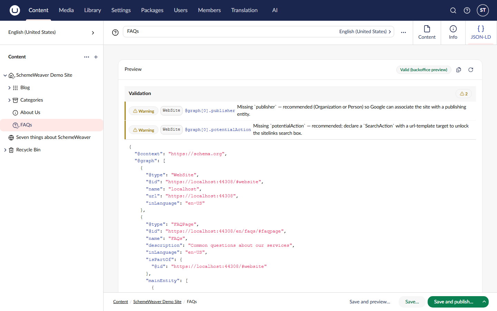
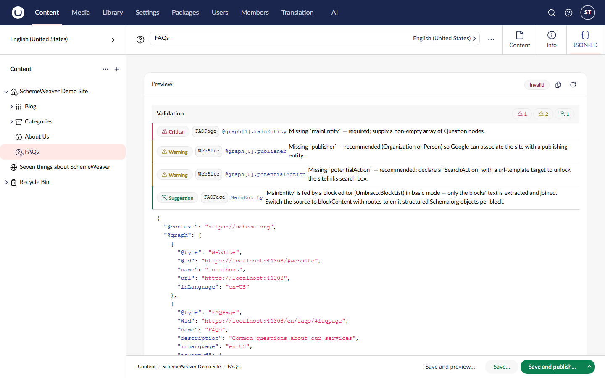

# Advanced Topics

This guide covers SchemeWeaver's deeper features: BreadcrumbList generation, JSON-LD output ordering, the workspace views, validation and suggestions, configuration, database schema, and troubleshooting. For extensibility and custom resolvers, see [Extending SchemeWeaver](extending.md).

## BreadcrumbList Auto-Generation

SchemeWeaver automatically generates a `BreadcrumbList` schema for every page that has at least one ancestor (i.e. is not the root node). This is handled by the `GenerateBreadcrumbJsonLd` method in `JsonLdGenerator`.

### How It Works

1. Starting from the current content node, the generator walks up the parent chain using Umbraco's `IDocumentNavigationQueryService`.
2. The current page is included as the last item in the breadcrumb trail.
3. The list is reversed to root-first order.
4. If the resulting list has fewer than 2 items, no breadcrumb is generated (root nodes have no meaningful trail).

Each `ListItem` in the breadcrumb includes:

| Property | Value |
|---|---|
| `position` | 1-based index (root = 1) |
| `name` | The content node's `Name` property |
| `item` / `@id` | Absolute URL resolved via `IPublishedUrlProvider` |

### Example Output

For a page at **Home > About > Our Team**, the generated BreadcrumbList looks like:

```json
{
  "@context": "https://schema.org",
  "@type": "BreadcrumbList",
  "itemListElement": [
    {
      "@type": "ListItem",
      "position": 1,
      "name": "Home",
      "item": "https://example.com/",
      "@id": "https://example.com/"
    },
    {
      "@type": "ListItem",
      "position": 2,
      "name": "About",
      "item": "https://example.com/about/",
      "@id": "https://example.com/about/"
    },
    {
      "@type": "ListItem",
      "position": 3,
      "name": "Our Team",
      "item": "https://example.com/about/our-team/",
      "@id": "https://example.com/about/our-team/"
    }
  ]
}
```

### Where BreadcrumbList Appears

Under the default `@graph` output, the breadcrumb is a graph piece: whenever the page has at least one ancestor it appears inside the single graph document emitted by both the tag helper and the Delivery API. In legacy mode (`UseGraphModel` set to `false`), the tag helper emits it as a separate `<script type="application/ld+json">` block, and the Delivery API includes it as a separate string unless `EmitBreadcrumbsInDeliveryApi` is `false`. Note that this flag only applies in legacy mode; under graph output the breadcrumb piece is emitted regardless, tracked in [issue #81](https://github.com/EnjoyDigital/Umbraco.Community.Schemeweaver/issues/81).

## JSON-LD Output Order

By default SchemeWeaver emits a single `@graph` document per page, so there is no multi-block ordering to think about: the graph pieces appear in a stable order inside one `<script type="application/ld+json">` element, cross-referenced by `@id`. See [The JSON-LD Output Model](json-ld-output.md) for the full model. The numbered inherited/breadcrumb/main/block ordering applies only when `UseGraphModel` is `false`, and is documented in that guide's [legacy mode section](json-ld-output.md#legacy-mode-one-script-per-source).

## Schema.org Workspace View

SchemeWeaver adds a **Schema.org** tab to the document type editor in the Umbraco backoffice. This tab (`schemeweaver-schema-mapping-view`) provides the primary interface for mapping content types to Schema.org types.

### Features

- **Schema type display**: shows the currently mapped Schema.org type (e.g. `Article`, `Event`) with the content type alias.
- **Inherited toggle**: a toggle switch that marks the schema as inherited, meaning it will be output on all descendant pages in addition to pages of this content type.
- **Property mapping table**: an editable table showing mapped Schema.org properties with dropdowns to select the Umbraco property source, source type, and source origin (parent, ancestor, sibling, static, blockContent, complexType). Additional properties can be added via the "Add property" combobox below the table. Individual rows can be removed using the trash icon on hover.
- **Auto-map**: a button that calls the auto-mapping endpoint to suggest property mappings based on name similarity and type compatibility. Suggestions are merged into the existing table, preserving any manual overrides.
- **Document type save integration**: persists the mapping to the database when the document type itself is saved via the backoffice.

The workspace view loads the existing mapping on mount by observing the workspace context's `alias` observable, and fetches both the schema properties and the content type properties to populate the dropdowns.


## JSON-LD Content View / Preview



SchemeWeaver adds a **JSON-LD** tab to content nodes (not document types) via the `schemeweaver-jsonld-content-view` workspace view. This tab shows a live preview of the JSON-LD that would be generated for the current content node.

### Two Preview Modes

The preview endpoint (`POST /mappings/{contentTypeAlias}/preview`) supports two modes based on whether a `contentKey` query parameter is provided:

| Mode | Trigger | Behaviour |
|---|---|---|
| **Real preview** | `contentKey` is provided and non-empty | Resolves the published content from the Umbraco content cache and generates actual JSON-LD using the stored mapping and live property values. |
| **Mock preview** | No `contentKey` (or empty) | Generates a mock JSON-LD based on the mapping configuration alone, using placeholder values. Useful when the content has not yet been published. |

### Content View Behaviour

1. On load, the view resolves the content type alias from the workspace context's `contentTypeUnique` observable.
2. It checks whether a schema mapping exists for this content type.
3. If a mapping exists and a content key is available, it requests a real preview.
4. If the content is unpublished (preview returns no data), a warning message is shown indicating that the content must be published first.
5. The preview shows a formatted JSON-LD block with syntax highlighting, a valid/invalid badge, and copy/refresh buttons.


## Validation and Suggestions

Every JSON-LD preview is run through a validator that checks the generated output against
Google's [structured-data requirements](https://developers.google.com/search/docs/appearance/structured-data)
for the schema type in question. The results appear in the **JSON-LD** preview tab (and in the
mock preview on the document type's Schema.org tab):

- A **valid / invalid badge** summarises whether the output is eligible for rich results.
- **Issues** are listed by severity:
  - **Critical**: a required property is missing or malformed; the result is ineligible until fixed.
  - **Warning**: a recommended property is missing; the result is eligible but weaker.
  - **Info**: informational notes.
  - **Suggestion**: a non-blocking improvement raised by the mapping advisor (see below).

Validation is rule-based and type-aware: there are dedicated rule sets for the common rich-result
types (Article, Product, Event, Recipe, FAQ, JobPosting, LocalBusiness, BreadcrumbList, and many
more), plus a generic eligibility check for everything else. Types without a specific rule set
still get the generic check, so you always get baseline feedback.

The same validation issues are returned by the preview API (`POST /mappings/{alias}/preview`) and
by the MCP `preview-json-ld` tool, so you can lint mappings programmatically as well as in the UI.

### Mapping advisories



Suggestion-severity items come from the mapping advisor, which inspects a mapping for concrete,
actionable improvements. There are five advisory kinds:

- **StripHtml**: an HTML-producing source (such as a rich text editor) feeds a plain-text Schema.org property without a `stripHtml` transform.
- **WrapInListItem**: a block list feeds an ordered-list property such as `itemListElement` without wrapping each entry in a `ListItem`.
- **MissingRequiredNestedProperty**: a known rich-result nested type (such as `Question`) is missing a property that Google requires.
- **ExportToUSync**: a save only reached the database while the uSync addon is installed, so the mapping will not reproduce on other environments until exported (see [uSync Integration](usync.md)).
- **PreferBlockContent**: a block editor mapped in basic property mode feeds a structured Schema.org target; switching the row to `blockContent` would emit real nested entities instead of a flattened value.

Advisories inform and suggest, they never modify the saved mapping.

## Configuration

All settings are optional and bind to a `SchemeWeaver` section in `appsettings.json`. The defaults
suit most sites; you only need this section to change behaviour.

```json
{
  "SchemeWeaver": {
    "UseGraphModel": true,
    "MaxRecursionDepth": 3,
    "EmitBreadcrumbsInDeliveryApi": true,
    "CacheDuration": "00:30:00",
    "PublicSiteUrl": "https://www.example.com",
    "SiteSettings": {
      "ContentTypeAlias": "schemaSiteSettings",
      "ContentKey": null
    },
    "SiteSearch": {
      "UrlTemplate": "https://example.com/search?q={search_term_string}",
      "QueryInputName": "search_term_string"
    }
  }
}
```

| Key | Default | Description |
|---|---|---|
| `UseGraphModel` | `true` | Output shape. `true` emits a single Yoast-style `@graph` envelope with cross-referenced `@id`s (best for modern SEO pipelines). `false` emits one `<script type="application/ld+json">` block per source (inherited mappings, breadcrumb, main mapping, block elements), useful for per-entity diffing or stricter CSP. The flag flows through the tag helper, Delivery API, Examine index and backoffice preview, so the preview always matches what ships. See [The JSON-LD Output Model](json-ld-output.md). |
| `MaxRecursionDepth` | `3` | Maximum depth for nested property resolution (content pickers, block lists). Guards against infinite loops in circular content. |
| `EmitBreadcrumbsInDeliveryApi` | `true` | Legacy mode only: when `UseGraphModel` is `false`, controls whether `BreadcrumbList` is included in the Delivery API `/json-ld` output. Under the default graph output the breadcrumb piece is emitted regardless of this flag ([issue #81](https://github.com/EnjoyDigital/Umbraco.Community.Schemeweaver/issues/81)). The server-rendered tag helper always emits breadcrumbs. |
| `CacheDuration` | `00:30:00` | Absolute cache duration for the per-content JSON-LD blocks served by the Delivery API. A safety-net only; invalidation is event-driven (publish/unpublish/move/delete). |
| `PublicSiteUrl` | `null` | Public origin (scheme + host) the emitted JSON-LD presents itself as. Set it on headless/decoupled sites where Umbraco is reached on a different host than the one your front-end serves pages on. Unset (default) derives every URL from the incoming request's host. See [Headless: the public site URL](#headless-the-public-site-url). |
| `SiteSettings.ContentTypeAlias` | `schemaSiteSettings` | Content type alias of the singleton settings node that drives the site-level part of the graph (Organization / WebSite pieces). The first published node of this type is used. See [the site settings node](json-ld-output.md#the-site-settings-node). |
| `SiteSettings.ContentKey` | `null` | Optional explicit GUID of the settings node. Overrides the alias-based lookup when the convention doesn't fit. See [the site settings node](json-ld-output.md#the-site-settings-node). |
| `SiteSearch.UrlTemplate` | `null` | Absolute URL template of your search results page, containing the literal `{search_term_string}` placeholder. When set, the WebSite graph node emits a `potentialAction` `SearchAction`, the markup Google requires for the sitelinks search box. Unset (default) emits no `potentialAction`. See [sitelinks search box](json-ld-output.md#sitelinks-search-box). |
| `SiteSearch.QueryInputName` | `search_term_string` | The variable name declared in `query-input` (`required name=…`) and expected as the `{placeholder}` in `UrlTemplate`. Rarely needs changing. See [sitelinks search box](json-ld-output.md#sitelinks-search-box). |
| `ExportMappingsToUSyncOnSave` | `false` | When `true`, the optional uSync addon exports a mapping to the uSync data folder every time it is saved or deleted in the backoffice. A SchemeWeaver-owned flag, deliberately independent of uSync's global `ExportOnSave`. No effect without the uSync addon installed. See [uSync Integration](usync.md). |
| `USyncBootImport` | `Off` | How the optional uSync addon imports committed mapping files on boot: `Off` (first-boot-only seeding), `Seed` (create missing mappings on every boot, never overwrites), `Upsert` (disk wins on every boot). No effect without the uSync addon installed. See [uSync Integration](usync.md). |

### Headless: the public site URL

By default every absolute URL SchemeWeaver emits — `@id`s, `url`, `image`, breadcrumb
items, the `{siteUrl}` token — is anchored to the **host the request arrived on**. On a
coupled site that is exactly right: the request host *is* the public site.

On a headless or decoupled site it usually isn't. Your front-end (Next.js, Nuxt, Astro)
calls the Delivery API server-to-server on the CMS's own hostname, so the JSON-LD it gets
back — and embeds verbatim into the public page — describes the CMS host:

```json
{ "@type": "WebSite", "@id": "https://cms.example.com/#website", "url": "https://cms.example.com" }
```

Google then reads structured data whose `@id`s and `url`s point at a host that isn't the
canonical site — the markup no longer corroborates the page it appears on.

Set the public origin and SchemeWeaver anchors everything to it instead:

```json
{ "SchemeWeaver": { "PublicSiteUrl": "https://www.example.com" } }
```

```json
{ "@type": "WebSite", "@id": "https://www.example.com/#website", "url": "https://www.example.com" }
```

Two things change when it is set:

1. The **site URL** — `WebSite`/`Organization` `@id`s, the `{siteUrl}` token, and the
   relative-URL fallback — derives from this origin rather than the request. This also
   makes site-level output work when there is **no request at all**, such as during
   Examine indexing.
2. Every absolute URL in the final serialised output that sits on the **request's**
   origin is rebased onto the public origin. That catches page URLs, media URLs and
   breadcrumb items wherever they were resolved, including those Umbraco's
   `IPublishedUrlProvider` returns already stamped with the CMS host.

URLs on any **other** host are left alone — CDN media, `sameAs` links to social profiles,
and any absolute URL an editor typed keep their own hostnames.

Notes:

- It is an **origin**, not a base path: a path, query or fragment on the value is ignored
  with a warning. Ports are preserved (`https://www.example.com:8443`).
- An unparseable or non-`http(s)` value is ignored with a warning, falling back to the
  request host — a typo in `appsettings.json` degrades, it never takes structured data down.
- The backoffice preview also resolves through it, so preview and live agree instead of
  diverging on the backoffice host (see `ResolvedBaseUrl` in the preview response).
- The alternative, if you would rather not pin the origin in configuration, is to have your
  front-end send `X-Forwarded-Host` / `X-Forwarded-Proto` and enable
  `UseForwardedHeaders` in the CMS. SchemeWeaver reads `Request.Host`, so correcting the
  request corrects the output too. `PublicSiteUrl` is the simpler option when the public
  origin is a known constant.

## Extending SchemeWeaver

Every core service in SchemeWeaver is registered against an interface, so you can replace or extend any part of the pipeline. The most common extension point is registering custom **property value resolvers** for unsupported property editors, but you can also replace the auto-mapper, JSON-LD generator, schema type registry, and persistence layer.

See **[Extending SchemeWeaver](extending.md)** for the full extensibility guide, including:

- Custom `IPropertyValueResolver` implementations (add alongside built-in resolvers)
- Overriding built-in resolvers with higher priority
- Replacing `ISchemaAutoMapper`, `IJsonLdGenerator`, `ISchemaTypeRegistry`, `ISchemaMappingRepository`, and `IContentTypeGenerator`
- Registration order with `[ComposeAfter]`

## Database Schema

SchemeWeaver creates two database tables, managed via Umbraco's migration system.

### SchemeWeaverSchemaMapping

Stores the top-level mapping between an Umbraco content type and a Schema.org type.

| Column | Type | Nullable | Description |
|---|---|---|---|
| `Id` | `int` | No | Auto-increment primary key |
| `ContentTypeAlias` | `nvarchar` | No | Umbraco content type alias (unique index) |
| `ContentTypeKey` | `uniqueidentifier` | No | Umbraco content type GUID key |
| `SchemaTypeName` | `nvarchar` | No | Schema.org type name (e.g. `Article`) |
| `IsEnabled` | `bit` | No | Whether JSON-LD generation is active |
| `CreatedDate` | `datetime` | No | When the mapping was created |
| `UpdatedDate` | `datetime` | No | When the mapping was last updated |
| `IsInherited` | `bit` | No | Whether this schema is output on descendant pages (default: 0) |
| `IdOverride` | `nvarchar` | Yes | Optional `@id` template that overrides the default `{url}#{type}` convention (tokens: `{url}`, `{type}`, `{key}`, `{culture}`, `{siteUrl}`); see [`@id` precedence](json-ld-output.md#id-precedence) |

### SchemeWeaverPropertyMapping

Stores individual property mappings within a schema mapping.

| Column | Type | Nullable | Description |
|---|---|---|---|
| `Id` | `int` | No | Auto-increment primary key |
| `SchemaMappingId` | `int` | No | Foreign key to `SchemeWeaverSchemaMapping.Id` |
| `SchemaPropertyName` | `nvarchar` | No | Schema.org property name (e.g. `headline`) |
| `SourceType` | `nvarchar` | No | Value source: `property`, `static`, `parent`, `ancestor`, `sibling`, `blockContent`, `complexType`, `reference` |
| `ContentTypePropertyAlias` | `nvarchar` | Yes | Umbraco property alias to read from |
| `SourceContentTypeAlias` | `nvarchar` | Yes | Content type alias filter for `parent`/`ancestor`/`sibling` sources |
| `TransformType` | `nvarchar` | Yes | Transform to apply: `stripHtml`, `toAbsoluteUrl`, `formatDate` |
| `IsAutoMapped` | `bit` | No | Whether this mapping was created by auto-map |
| `StaticValue` | `nvarchar` | Yes | Static value (used when `SourceType` is `static`) |
| `NestedSchemaTypeName` | `nvarchar` | Yes | Nested Schema.org type name for complex type mappings |
| `ResolverConfig` | `nvarchar(max)` / `TEXT` | Yes | JSON configuration for property resolvers (e.g. sub-mappings for complex types) |
| `DynamicRootConfig` | `nvarchar(max)` / `TEXT` | Yes | JSON configuration for Umbraco dynamic root settings (origin and query steps) used by `parent`/`ancestor`/`sibling` sources |
| `TargetPieceKey` | `nvarchar` | Yes | For the `reference` source type: the key of the graph piece whose `@id` this property resolves to (e.g. `organization`) |

### Migration History

The tables are created and updated via six migrations in `SchemeWeaverMigrationPlan`:

1. **`schemeweaver-tables-v1`** (`CreateTablesMigration`): creates both tables with all original columns.
2. **`schemeweaver-add-resolver-config-v2`** (`AddResolverConfigMigration`): adds the `ResolverConfig` column to `SchemeWeaverPropertyMapping`.
3. **`schemeweaver-add-is-inherited-v3`** (`AddIsInheritedMigration`): adds the `IsInherited` column to `SchemeWeaverSchemaMapping`.
4. **`schemeweaver-add-dynamic-root-config-v4`** (`AddDynamicRootConfigMigration`): adds the `DynamicRootConfig` column to `SchemeWeaverPropertyMapping`.
5. **`schemeweaver-add-id-override-v5`** (`AddIdOverrideMigration`): adds the `IdOverride` column to `SchemeWeaverSchemaMapping`.
6. **`schemeweaver-add-target-piece-key-v6`** (`AddTargetPieceKeyMigration`): adds the `TargetPieceKey` column to `SchemeWeaverPropertyMapping`.

Migrations use raw SQL for SQLite compatibility, as Umbraco's fluent migration builder does not support `ALTER TABLE` on SQLite.

## Troubleshooting

### No JSON-LD output on the page

**Symptoms**: The `<scheme-weaver content="@Model" />` tag helper produces no output, or the Delivery API `schemaOrg` field is missing.

**Checks**:
1. Verify the content type has a mapping: go to the document type editor and check the **Schema.org** tab. If no mapping exists, create one.
2. Ensure the mapping is **enabled** (`IsEnabled` must be true).
3. Confirm the content is **published**. JSON-LD is only generated for published content.
4. Check the Umbraco logs for warnings from `JsonLdGenerator` or `SchemaJsonLdContentIndexHandler`.

### Empty properties in the JSON-LD

**Symptoms**: The JSON-LD is generated but some properties are missing or null.

**Checks**:
1. Ensure the Umbraco property has a value on the published content. Draft values are not used.
2. Check the **source type** is correct. If set to `parent` or `ancestor`, verify that the source content type is correct and the ancestor has the specified property with a value.
3. For **media picker** properties, ensure the media item is published and has a file.
4. For **rich text** properties, note that empty HTML (e.g. `<p></p>`) is treated as empty after stripping.
5. String values that are empty or whitespace-only are automatically excluded from the output.

### Relative URLs in JSON-LD instead of absolute

**Symptoms**: URLs in the generated JSON-LD are relative paths (e.g. `/media/image.jpg`) rather than absolute URLs.

**Explanation**: SchemeWeaver resolves absolute URLs using the current HTTP request's scheme and host. If the request context is unavailable (e.g. during background indexing), URLs may fall back to relative paths.

**Solutions**:
1. Ensure your Umbraco instance has a configured domain/hostname in **Settings > Culture and Hostnames**.
2. For the Delivery API, absolute URLs should resolve correctly during the indexing pipeline as the request context is available.
3. For property values, the `toAbsoluteUrl` transform can be applied to convert relative paths. This is configured in the property mapping's `TransformType`.

### Block content not appearing in JSON-LD

**Symptoms**: Block elements in BlockList or BlockGrid properties do not generate their own JSON-LD.

**Checks**:
1. The block element's document type must have its own **separate schema mapping**. Block element schemas are generated independently from the parent page's schema.
2. Block elements only support `property` and `static` source types. Source types like `parent`, `ancestor`, and `sibling` are not available for block elements as they do not exist in the content tree.
3. If the block property is already **explicitly mapped** via the `blockContent` source type on the parent page's mapping, it is excluded from automatic block element scanning to avoid duplication.
4. Verify the block element type's mapping is enabled.

### Preview shows "Publish required" message

**Symptoms**: The JSON-LD preview tab on a content node shows a warning instead of the JSON-LD.

**Explanation**: The real preview mode requires published content. If the content node has never been published, the preview endpoint cannot resolve it from the content cache.

**Solution**: Publish the content at least once. Alternatively, view the mock preview from the document type editor's Schema.org tab, which shows placeholder values based on the mapping configuration alone.

### Inherited schemas not appearing on child pages

**Symptoms**: A schema marked as "inherited" (e.g. `WebSite` on the home page) does not appear on descendant pages.

**Checks**:
1. Confirm the **Inherited** toggle is enabled on the mapping (Schema.org tab on the document type editor).
2. The inherited schema walks from the **parent** upwards, not from the current page. The current page's own schema is generated separately.
3. After changing the inherited flag, you need to **save the mapping** and **republish the descendant content** for the Delivery API index to update.
