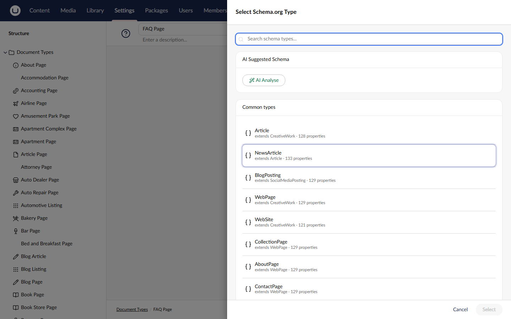

# AI Integration

SchemeWeaver offers an optional companion package, **Umbraco.Community.SchemeWeaver.AI**, that uses [Umbraco.AI](https://marketplace.umbraco.com/package/umbraco.ai.core) to provide AI-powered schema mapping. When installed, it adds AI suggestion buttons to the existing SchemeWeaver UI and registers Copilot tools for conversational schema mapping.

If the AI package is not installed, SchemeWeaver works exactly as before: the heuristic auto-mapper handles all suggestions.

---

## Requirements

| Requirement | Version |
|---|---|
| Umbraco | **17 and 18**: the AI satellite's version tracks the Umbraco major (17.x for Umbraco 17, 18.x for Umbraco 18) and pulls the matching major-aligned Umbraco.AI line |
| Umbraco.Community.SchemeWeaver | Same version as the AI package |
| Umbraco.AI | Major-aligned with your Umbraco: `[17.0.0, 18.0.0)` on Umbraco 17, `[18.0.0, 19.0.0)` on Umbraco 18 (pulled automatically as a dependency) |
| A configured AI chat provider | e.g. Anthropic or Azure OpenAI, via the matching Umbraco.AI provider package |

The AI package depends on `IAIChatService` from `Umbraco.AI.Core.Chat`. You must have a chat **connection and profile** configured in your Umbraco instance for AI features to work (see Installation below). Refer to the [Umbraco.AI documentation](https://docs.umbraco.com/umbraco-ai) for provider setup.

---

## Installation

Install the satellite package into the same project as SchemeWeaver:

```bash
dotnet add package Umbraco.Community.SchemeWeaver.AI
```

You also need Umbraco.AI itself and a provider. Two things commonly trip people up:

1. **Install the umbrella `Umbraco.AI` package** (not just `Umbraco.AI.Startup`) so the
   **AI** section renders in the backoffice, plus a provider package (e.g.
   `Umbraco.AI.Anthropic`), and call `.AddUmbracoAI()` in your builder chain.
2. **Configure a chat connection and set a Default Chat Profile.** In **Settings → AI**,
   add a connection for your provider (with its API key) and mark a chat profile as the
   default. Without a default profile the AI calls throw and SchemeWeaver silently falls
   back to the heuristic mapper, so the AI buttons appear but suggestions never improve.

No additional SchemeWeaver configuration is needed. The `SchemeWeaverAIComposer` registers the AI services and controller automatically. The frontend detects the AI package by calling `GET /ai/status` and shows AI buttons only when it returns successfully.

---

## Features

### AI Schema Type Suggestions

AI type suggestions surface in three places. The first is the **AI Analyse** entity action, which appears on each document type (in both the tree context menu and the workspace action menu). This action:

1. Analyses the content type's name, property names, editor types, and descriptions
2. Returns up to 3 ranked Schema.org type suggestions with confidence scores and reasoning
3. Opens the schema picker with the top suggestion pre-highlighted

The second is the **AI Analyse All** entity action on the Document Types tree root, which runs the analysis for every content type in one batch (see AI Bulk Analysis below). The third is inside the schema picker modal itself: with the AI package installed, the picker shows an **AI Suggested Schema** box with its own **AI Analyse** button, so you can request suggestions without leaving the picker.



The AI validates its suggestions against SchemeWeaver's type registry, so only valid Schema.org types from the Schema.NET.Pending library are returned.

### AI Bulk Analysis

The **AI Analyse All** entity action on the Document Types tree root opens the **AI Analysis Results** modal, which analyses every non-element content type in a single batch:

- Results are displayed as a table with the columns Content Type, Schema Type, Confidence and Reasoning
- Rows with confidence of 70% or above are pre-selected
- Confidence is shown as a colour-coded tag: green (80%+), amber (50-79%), grey (below 50%)
- Click the **Apply (n)** button in the modal footer (n counts the selected rows) to create mappings for all selected rows in one operation

For each selected row, the bulk apply process:

1. Calls the AI auto-map endpoint to get property mapping suggestions
2. Filters suggestions to those with confidence of 50% or above
3. Saves the mapping via the standard SchemeWeaver API

### AI Property Mapping

When mapping properties (either from the bulk flow or the individual mapping modal), the AI package enhances the auto-mapping process:

- The AI analyses content type properties semantically, understanding that `bodyText` maps to `articleBody` even without an explicit synonym entry
- The AI result is **authoritative**: a well-formed AI suggestion wins outright for its schema property. Heuristic suggestions only fill schema properties the AI did not map, and every remaining schema property is listed as an unmapped placeholder for completeness
- If the AI call fails or returns nothing usable, the endpoint falls back entirely to heuristic suggestions

This strategy means AI enhances accuracy without sacrificing reliability.

### Umbraco Copilot Tools

The AI package registers four tools under the `schemeweaver-mapping` scope for use with Umbraco's AI Copilot:

| Tool | Description |
|---|---|
| `schemeweaver_suggest_schema_type` | Suggest Schema.org types for a content type |
| `schemeweaver_map_properties` | Suggest property mappings for a content type / schema type pair |
| `schemeweaver_save_mapping` | Save a schema mapping (marked as destructive) |
| `schemeweaver_list_mappings` | List all existing schema mappings |

These tools allow conversational workflows like "Map my Blog Post content type to Schema.org" through the Umbraco Copilot interface.

---

## API Endpoints

All AI endpoints are under `/umbraco/management/api/v1/schemeweaver/ai` and require backoffice authentication. For full request/response details, see the [API Reference](api-reference.md#ai-integration-optional).

| Method | Endpoint | Description |
|---|---|---|
| `GET` | `/ai/status` | Check if the AI package is installed (200 = yes, 404 = no) |
| `POST` | `/ai/suggest-schema-type/{contentTypeAlias}` | AI schema type suggestions for one content type |
| `POST` | `/ai/suggest-schema-types-bulk` | AI schema type suggestions for all content types |
| `POST` | `/ai/ai-auto-map/{contentTypeAlias}?schemaTypeName=X` | AI-enhanced property mapping suggestions |

---

## How It Works

The `AISchemaMapper` service orchestrates all AI operations:

1. **System prompts** guide the LLM with Schema.org expertise, Umbraco editor type awareness (TextBox, RichText, MediaPicker3, BlockList, etc.), and a calibrated confidence scale
2. **JSON extraction** handles markdown fences and extra text that LLMs sometimes wrap around JSON responses
3. **Registry validation** filters AI suggestions against the actual Schema.NET.Pending type list, discarding any hallucinated type names
4. **Merge strategy** for property mapping always retrieves heuristic suggestions as a baseline (they are fed to the AI as context), then treats the AI's suggestions as authoritative: the heuristic only fills schema properties the AI left unmapped

The architecture ensures reliability: if the AI call fails or produces nothing usable, the heuristic baseline is returned unchanged.

---

## Troubleshooting

### AI buttons do not appear in the UI

The frontend checks `GET /ai/status` on load. If it returns 404, the AI package is not installed or registered. Verify:

1. The `Umbraco.Community.SchemeWeaver.AI` NuGet package is referenced in your project
2. The application has been restarted after installation
3. No DI registration errors appear in the Umbraco log at startup

### AI suggestions return errors

If the AI endpoints return 500 errors, check:

1. Umbraco.AI.Core is installed and configured with a chat provider
2. The chat provider's API key / connection string is valid
3. The Umbraco log for detailed error messages from `AISchemaMapper`

### AI suggests invalid Schema.org types

The AI validates suggestions against the Schema.NET.Pending type registry. If you see unexpected results, the LLM may be suggesting types that exist in Schema.org but are not yet in the Schema.NET.Pending library. The invalid suggestions are automatically filtered out before being returned to the UI.
