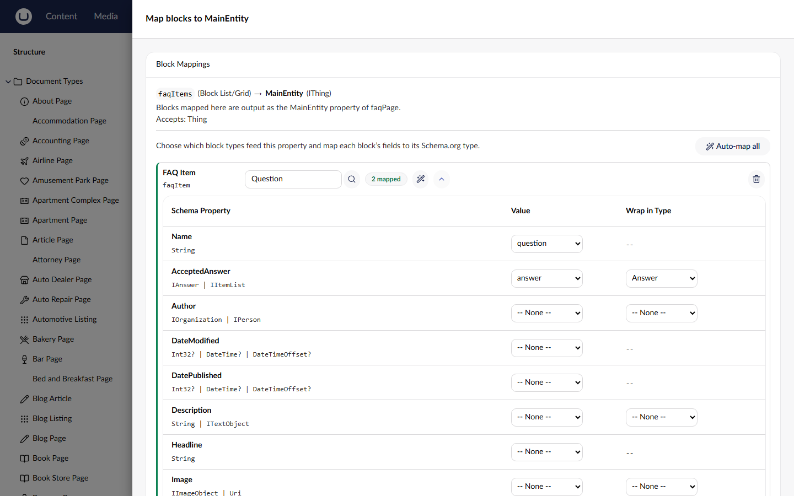
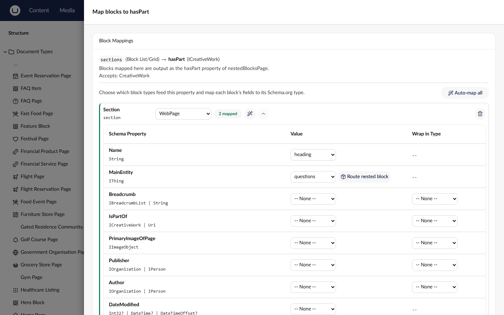

# Block Content Mapping

Block content mapping allows SchemeWeaver to extract structured data from Umbraco's BlockList and BlockGrid editors, transforming block elements into nested Schema.org types within your JSON-LD output. This is essential for schemas that require arrays of structured objects: FAQ questions, product reviews, recipe steps, and similar patterns.

---

## Overview

Umbraco's block editors store collections of typed elements. Each block element is an `IPublishedElement` with its own content type and properties. SchemeWeaver's `BlockContentResolver` reads these collections and maps each element to a Schema.NET `Thing` (or extracts simple string values), producing nested JSON-LD that search engines can consume as part of the page's output (assembled as described in [The JSON-LD Output Model](json-ld-output.md)).

There are two ways to use a block editor in a mapping: leave it on the plain Current Node (`property`) source for basic text extraction (covered next), or use the `blockContent` source type to emit structured objects, one Schema.org Thing per block. The `blockContent` route is the subject of most of this page; see [Property Mappings](property-mappings.md) for the full source-type reference.

The block content source type (`blockContent`) is available when:

- The matched Umbraco property uses a block editor (`Umbraco.BlockList` or `Umbraco.BlockGrid`)
- The Schema.org property is flagged as a complex type

---

## Basic Text Extraction (property mode)

The simplest option first: a block editor property does not have to use the `blockContent` source type at all. Mapped on the plain **Current Node (`property`)** source with no block configuration, the resolver falls back to basic text extraction: it walks the block items (nested block editors and Block Grid areas included, up to the recursion depth limit), reads every text-producing property (Textstring, Textarea, Rich Text, Markdown), strips HTML, and joins the fragments into one plain-text string.

This is the quick path for plain-text targets: mapping a page's content blocks straight onto `description` or `articleBody` without configuring routes. Anything that is not prose (media, pickers, numbers, settings) is ignored. For structured output (one Schema.org object per block) use the `blockContent` source type described in the rest of this document; when a block editor in property mode feeds a target that expects structured objects, the PreferBlockContent advisory raises a suggestion (surfaced at suggestion severity).

---

## How Resolution Works

The `BlockContentResolver` follows this process:

1. **Extract block items**: Reads the property value and extracts `IPublishedElement` content items from either a `BlockListModel` or `BlockGridModel`.

2. **Check for string extraction mode**: If the resolver config specifies `"extractAs": "stringList"`, each block item has a single named property extracted as a plain string. The result is a `List<string>` rather than a list of Things. This is used for Schema.org properties that expect string arrays (e.g., `recipeIngredient`).

3. **Map to Things**: For each block element, the resolver creates an instance of the configured Schema.org type (`NestedSchemaTypeName`) and populates it using either:
   - **Configured nested mappings** from the `ResolverConfig` JSON, or
   - **Auto-mapping by name** if no nested mappings are configured (matches block property aliases to schema property names, case-insensitive)

4. **Apply wrapping**: If a nested mapping specifies `wrapInType`, the resolved value is wrapped in an intermediate Schema.org type before being set on the parent Thing.

5. **Return collection**: The resolver returns a `List<Thing>` which Schema.NET serialises as a JSON array in the output.

Recursion is limited to a maximum depth of 3 (configurable via the `SchemeWeaver:MaxRecursionDepth` setting in appsettings) to prevent infinite loops.

---

## Nested Blocks (Blocks Inside Blocks) and Block Grid Areas

Real-world content is rarely one level deep. SchemeWeaver resolves two forms of nesting:

1. **A block whose own property is itself a Block List/Grid**: e.g. a `section` block that
   contains a nested `questions` Block List of `faqItem` blocks. When a route's property
   mapping targets such a property, give it its own `routes` and resolution recurses, emitting
   the inner blocks as nested Things.
2. **Block Grid areas**: blocks placed inside a Block Grid item's layout *areas* are traversed
   too (previously only top-level grid items were read). Area layout carries no Schema.org
   meaning, so area blocks are flattened into the parent collection.

Both are depth-capped (max 3) and cycle-guarded.

The route shape is **recursive**: a route's `propertyMappings` entry may itself carry `routes`,
nesting the routing model one level deeper. For example, an outer `section` block routed to a
`WebPage` whose nested `questions` Block List routes each `faqItem` to a `Question`:

```json
{
  "routes": [
    {
      "blockAlias": "section",
      "nestedSchemaType": "WebPage",
      "propertyMappings": [
        { "schemaProperty": "name", "contentProperty": "heading" },
        {
          "schemaProperty": "mainEntity",
          "contentProperty": "questions",
          "routes": [
            {
              "blockAlias": "faqItem",
              "nestedSchemaType": "Question",
              "propertyMappings": [
                { "schemaProperty": "name", "contentProperty": "question" },
                { "schemaProperty": "acceptedAnswer", "contentProperty": "answer",
                  "wrapInType": "Answer", "wrapInProperty": "text" }
              ]
            }
          ]
        }
      ]
    }
  ]
}
```

This produces a `WebPage` with a `mainEntity` array of `Question` objects resolved from the
section's *own* nested Block List. In the backoffice the block-mapping panel surfaces nested
block element types as an expandable tree, and "Auto-map all" proposes nested routes.

---

## String Extraction Mode

Some Schema.org properties expect flat string arrays rather than nested objects. For example, `recipeIngredient` expects a list of ingredient strings, not a list of `Thing` objects.

String extraction mode is activated by setting `"extractAs": "stringList"` in the resolver config, along with `"contentProperty"` to name the block element property to read from.

**Resolver config:**

```json
{
  "extractAs": "stringList",
  "contentProperty": "ingredient"
}
```

**Behaviour:** Each block element in the BlockList has its `ingredient` property read as a string. The result is a JSON array of strings:

```json
{
  "recipeIngredient": [
    "200g plain flour",
    "100g caster sugar",
    "2 large eggs"
  ]
}
```

---

## The Block Mapping Panel

Block mappings are configured per row: each mapping-table row whose property is a block editor shows a **Map blocks** button, which opens the "Map blocks to ..." panel scoped to that schema property.



The panel's header shows the context: the block property, its editor kind, and the target schema property with the types it accepts. The **Block Mappings** box then lists every block element type configured on the editor:

- Each block row shows the element's name and alias, a **{n} mapped** tag once it has mappings, and row actions: **Auto-map**, expand/collapse, and **Remove mapping**. Unmapped rows carry a **Not mapped** tag and a **Map this block** action.
- Expanding a row reveals its mapping table (Schema Property, Value, Wrap in Type). Different block types can map to different Schema.org types, so a heterogeneous list emits a differently-typed object per element type.
- **Auto-map all** fills every block row at once. Auto-mapping runs a three-tier matching algorithm (exact name match, then partial match, then complex-type sub-property match, e.g. the block's `ratingValue` matching `Rating.ratingValue` inside `reviewRating` and wrapping accordingly) and only fills empty mappings; manual selections are never overwritten.
- When some blocks in the list would better fit a different schema property, a fan-out banner offers **Create rows for other properties**.

For a block whose own property is itself a Block List or Grid, the expanded row offers a **Route nested block** toggle, which nests the routing model one level deeper (see [Nested Blocks](#nested-blocks-blocks-inside-blocks-and-block-grid-areas) above):



Saving the panel writes the `routes` configuration onto the mapping row; the JSON it produces is exactly the shape documented throughout this page.

---

## wrapInType Configuration

The `wrapInType` feature is one of the most important aspects of block content mapping. Many Schema.org properties expect values wrapped in an intermediate type rather than a raw string. Without wrapping, the JSON-LD would be structurally invalid for these properties.

### What It Does

When a nested mapping includes `wrapInType`, the resolver:

1. Resolves the raw value from the block element property
2. Creates a new instance of the specified Schema.org wrapper type
3. Sets the resolved value on the wrapper type's property (specified by `wrapInProperty`, or inferred)
4. Sets the wrapper instance as the value of the parent Thing's property

### When It Is Needed

Wrapping is needed whenever a Schema.org property expects a structured type but your block element stores the data as a simple value. Common scenarios:

- **FAQ answers**: Schema.org's `acceptedAnswer` expects an `Answer` object with a `text` property, but your block likely stores the answer as a plain rich text field
- **Review ratings**: `reviewRating` expects a `Rating` object with a `ratingValue` property, but your block stores the rating as a number
- **Nested sub-types**: Any case where a schema property's accepted type has its own properties and your block stores only one of those sub-properties

### JSON Config Format

The `wrapInType` and `wrapInProperty` fields are set per nested mapping entry:

```json
{
  "nestedMappings": [
    {
      "schemaProperty": "acceptedAnswer",
      "contentProperty": "answer",
      "wrapInType": "Answer",
      "wrapInProperty": "Text"
    }
  ]
}
```

- **`wrapInType`** (required for wrapping): The Schema.org type name to create as a wrapper (e.g., `"Answer"`, `"Rating"`)
- **`wrapInProperty`** (optional): The property on the wrapper type to set the value on. If omitted, the resolver infers the best property by:
  1. Exact name match between the content property and the wrapper type's schema properties
  2. Partial/contains match
  3. Fallback to `"Text"`

### Concrete Examples

**FAQ: wrapping an answer in an Answer type**

Without wrapping, the answer text would be set directly on `acceptedAnswer`, which is invalid because Schema.org expects an `Answer` object. With wrapping:

```json
{
  "nestedMappings": [
    {
      "schemaProperty": "name",
      "contentProperty": "question"
    },
    {
      "schemaProperty": "acceptedAnswer",
      "contentProperty": "answer",
      "wrapInType": "Answer",
      "wrapInProperty": "Text"
    }
  ]
}
```

**Output:**
```json
{
  "@type": "Question",
  "name": "What is SchemeWeaver?",
  "acceptedAnswer": {
    "@type": "Answer",
    "text": "A community package for Umbraco that generates JSON-LD."
  }
}
```

**Product Review: wrapping a rating value in a Rating type**

```json
{
  "nestedMappings": [
    {
      "schemaProperty": "author",
      "contentProperty": "reviewAuthor"
    },
    {
      "schemaProperty": "reviewRating",
      "contentProperty": "ratingValue",
      "wrapInType": "Rating",
      "wrapInProperty": "RatingValue"
    },
    {
      "schemaProperty": "reviewBody",
      "contentProperty": "reviewBody"
    }
  ]
}
```

**Output:**
```json
{
  "@type": "Review",
  "author": "Jane Smith",
  "reviewRating": {
    "@type": "Rating",
    "ratingValue": "5"
  },
  "reviewBody": "Excellent product, highly recommended."
}
```

### Auto-Detection in the Block Mapping Panel

The block mapping panel automatically detects when wrapping is needed. When you select a content property for a complex schema property, the panel:

1. Checks all accepted types for the schema property
2. Looks for exact or partial name matches between the content property name and the accepted type's sub-properties
3. Falls back to the first accepted type with a `Text` property

The auto-detected wrap type is shown as a badge in the "Wrap In Type" column and can be overridden by clicking the edit button.

---

## Common Patterns

The auto-mapper includes pre-configured resolver configs for popular Schema.org patterns. These are applied automatically when the appropriate schema type and property combination is detected.

### FAQ Question/Answer

**Schema type:** `FAQPage` | **Property:** `mainEntity` | **Nested type:** `Question`

```json
{
  "nestedMappings": [
    {
      "schemaProperty": "name",
      "contentProperty": "question"
    },
    {
      "schemaProperty": "acceptedAnswer",
      "contentProperty": "answer",
      "wrapInType": "Answer",
      "wrapInProperty": "Text"
    }
  ]
}
```

Your BlockList should have a block element type with at least two properties: one for the question text (e.g., `question`) and one for the answer text (e.g., `answer`). The answer is wrapped in an `Answer` type with the value set on the `Text` property.


### Product Review with Rating

**Schema type:** `Product` | **Property:** `review` | **Nested type:** `Review`

```json
{
  "nestedMappings": [
    {
      "schemaProperty": "author",
      "contentProperty": "reviewAuthor"
    },
    {
      "schemaProperty": "reviewRating",
      "contentProperty": "ratingValue",
      "wrapInType": "Rating",
      "wrapInProperty": "RatingValue"
    },
    {
      "schemaProperty": "reviewBody",
      "contentProperty": "reviewBody"
    }
  ]
}
```

Your review block element should have properties for the reviewer's name, a numeric rating value, and the review text. The rating value is wrapped in a `Rating` type.


### Recipe HowToStep

**Schema type:** `Recipe` | **Property:** `recipeInstructions` | **Nested type:** `HowToStep`

```json
{
  "nestedMappings": [
    {
      "schemaProperty": "name",
      "contentProperty": "stepName"
    },
    {
      "schemaProperty": "text",
      "contentProperty": "stepText"
    }
  ]
}
```

Each block element represents a single step with a name and description text. The same pattern applies to `HowTo.step`.


### Recipe Ingredients as String List

**Schema type:** `Recipe` | **Property:** `recipeIngredient` | **Nested type:** *(none)*

```json
{
  "extractAs": "stringList",
  "contentProperty": "ingredient"
}
```

This uses string extraction mode rather than Thing mapping. Each block element's `ingredient` property is read as a plain string, producing a JSON array of strings in the output.

The same pattern applies to `HowTo.tool`:

```json
{
  "extractAs": "stringList",
  "contentProperty": "toolName"
}
```

---

## Block Element Auto-Mapping

SchemeWeaver supports a separate auto-mapping path for block elements that have their own independent schema mappings. The `GenerateBlockElementJsonLdStrings` method on the `JsonLdGenerator`:

1. Loads all enabled schema mappings and indexes them by content type alias
2. Identifies which block properties on the current page are already explicitly mapped as `blockContent` (to avoid duplicate output)
3. Iterates through all BlockList/BlockGrid properties on the current content node
4. For each block element, checks whether its content type alias has a schema mapping
5. If a mapping exists, generates a standalone Thing from the block element using only `property` and `static` source types (block elements have no parents or ancestors)

This means you can create schema mappings for your block element types directly (e.g., mapping a `faqItem` element type to `Question`), and they will be emitted as separate JSON-LD objects on the page. This approach is an alternative to the nested `blockContent` source type and is useful when block elements represent standalone entities.

---

## Troubleshooting Nested Types

### Empty nested objects in JSON-LD output

If a nested type appears as an empty `{}` or is missing entirely:

- Check that the block element's content properties match the aliases specified in your `nestedMappings` config (case-sensitive for property aliases)
- Verify that the block elements have published content with non-null values
- Check the `nestedSchemaTypeName` is a valid Schema.org type name (e.g., `Question`, not `question`)

### String values where objects are expected

If you see `"acceptedAnswer": "The answer text"` instead of a wrapped object:

- Add `wrapInType` and `wrapInProperty` to the nested mapping entry
- The auto-mapper's pre-configured defaults handle common cases, but custom block structures may need manual wrapping configuration

### Block elements not appearing in wizard

If the wizard shows "no block types" in step 1:

- Ensure the BlockList/BlockGrid property has element types configured in its data type settings
- The wizard reads element types from the property's configuration; if this cannot be resolved, you can manually type the block element alias

### Recursion depth limit

Nested resolution is limited to a depth of 3 by default. If you have deeply nested block structures (blocks containing blocks containing blocks), values beyond depth 3 will return null. This is a safety measure to prevent infinite loops.

### Duplicate JSON-LD objects

If the same structured data appears twice on a page:

- Check whether the block element type has both a direct schema mapping (via `GenerateBlockElementJsonLdStrings`) and a `blockContent` mapping on the parent page. The generator explicitly excludes properties already mapped as `blockContent` to avoid this, but verify your mapping configuration if duplicates occur.
