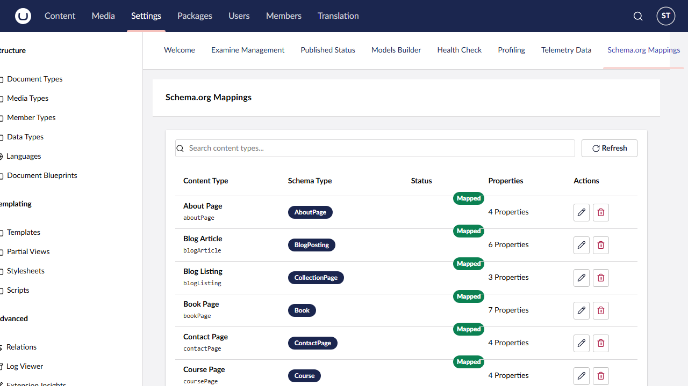
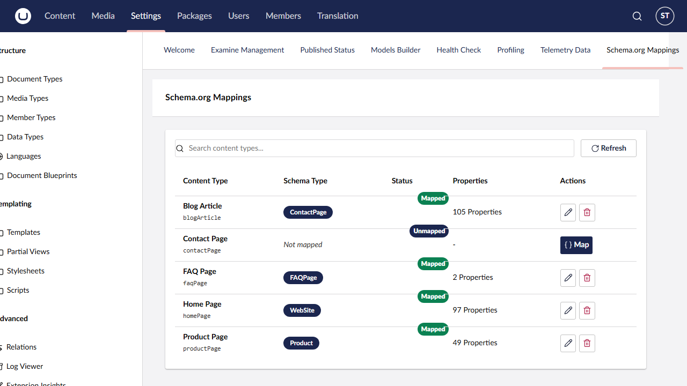

# Dashboard

The Schema.org Mappings dashboard is the central hub for managing all content type mappings in your Umbraco instance. It provides an at-a-glance view of which content types are mapped, how many properties each mapping has, and quick actions to create, edit, or delete mappings.

## Accessing the dashboard

Open the Umbraco backoffice and navigate to the **Settings** section. The **Schema.org Mappings** tab appears in the Settings dashboard area. The dashboard loads automatically when selected, fetching all content types and their current mapping status in parallel.

## Content types table

The dashboard displays a table with one row per content type in your Umbraco instance. The table has five columns:

### Content Type

Shows the **display name** of the content type in bold, with the **alias** displayed below in monospace text. For example:

> **Blog Post**
> `blogPost`

Both the name and alias are searchable (see [Search](#search-functionality) below).

### Schema Type

Displays the mapped Schema.org type name as a coloured tag (e.g. `BlogPosting`, `Product`, `Event`). If the content type has no mapping, this column shows "Not mapped" in italic grey text.

### Status

Shows a badge indicating the mapping state:

- **Mapped** (green badge) -- the content type has an active Schema.org mapping. If the mapping is also marked as inherited, an additional **Inherited** tag appears in an outline style beside the badge, indicating that this schema will be output on all descendant pages.
- **Unmapped** (default/grey badge) -- no mapping exists for this content type.

### Properties

For mapped content types, shows the number of property mappings configured (e.g. "5 Properties"). For unmapped content types, shows a dash (`-`).

### Actions

The available actions depend on whether the content type is currently mapped:

**For unmapped content types:**

- **Map** (primary button with brackets icon) -- opens the schema picker modal to begin the mapping workflow. After selecting a Schema.org type, the property mapping modal opens automatically so you can review auto-mapped suggestions and save. See [Mapping Content Types](mapping-content-types.md) for the full walkthrough.

**For mapped content types:**

- **Edit** (outline button with edit icon) -- opens the property mapping modal for the existing mapping, allowing you to adjust property assignments, change source types, or toggle the inherited flag.
- **Delete** (outline danger button with trash icon) -- removes the mapping entirely. A success notification ("Mapping deleted successfully") confirms the deletion, and the table refreshes to show the updated state.

## Search functionality

The search input at the top of the dashboard filters the content types table in real time as you type. The filter matches against:

- Content type **name** (case-insensitive)
- Content type **alias** (case-insensitive)
- Mapped **Schema.org type name** (case-insensitive)

For example, typing "blog" would show content types named "Blog Post", "Blog Author", or any content type mapped to a schema type containing "blog". Typing "article" would match content types mapped to `Article`, `NewsArticle`, `BlogPosting` (since "article" appears in the full schema type hierarchy), and any content types with "article" in their name or alias.

When no content types match the search term, the table is replaced with the message: "No content types found matching your search."

Clear the search field to restore the full list.

## Refresh button

The **Refresh** button (with a refresh icon) sits beside the search input. Clicking it re-fetches both the content types and mappings from the server, updating the table to reflect any changes made elsewhere -- for instance, if another user created a mapping from the document type editor, or if content types were added or removed.

During loading, the table is replaced with a spinner and the text "Loading schema mappings..."

## Workflow: mapping from the dashboard

The dashboard's Map button provides the same two-step workflow available from the document type editor's entity action:

1. **Schema picker modal** -- search and select a Schema.org type from the 657 available types, grouped by parent type.
2. **Property mapping modal** -- review auto-mapped property suggestions, adjust source types and values, then save.

After saving (or cancelling), the dashboard automatically refreshes to show the updated mapping status.

For a detailed guide to each step, see [Mapping Content Types](mapping-content-types.md).

## Tips

- **Start with your most important content types.** Map your primary page types (articles, products, events) first to get the greatest SEO benefit quickly.
- **Use search to find unmapped types.** Type "unmapped" will not work as a filter (it matches against names and aliases, not status text). Instead, scan the Status column visually, or sort mentally by looking for grey badges.
- **Mappings take effect immediately.** Once saved, the next publish of content using that type will include JSON-LD output. There is no separate "activate" step.
- **Deleting a mapping is immediate.** There is no confirmation dialog. If you delete a mapping by mistake, you will need to recreate it from the Map button.
