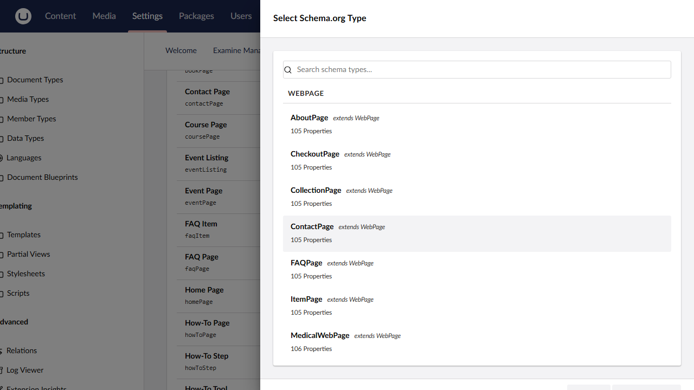
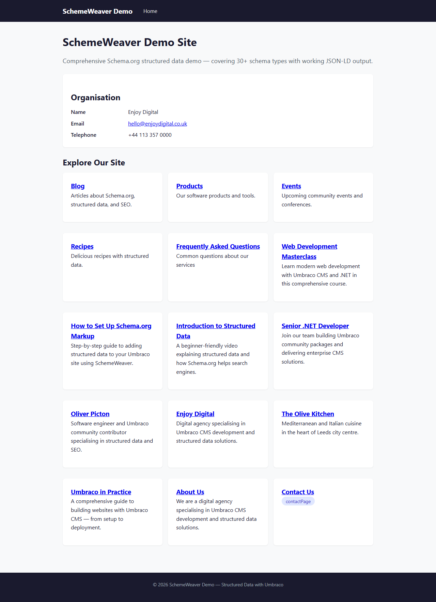

# Getting Started

This guide walks you through installing SchemeWeaver, creating your first Schema.org mapping, and verifying the JSON-LD output on your published pages.

## Requirements

| Requirement | Version |
|---|---|
| Umbraco CMS | 17.0.0 or later (up to, but not including, 18.0.0) |
| .NET | 10 |
| Schema.NET | 13.0.0 (installed automatically as a dependency) |

SchemeWeaver targets `net10.0` and uses the `Microsoft.NET.Sdk.Razor` SDK. No additional runtime dependencies are required beyond what Umbraco 17 already provides.

## Installation

Install the NuGet package into your Umbraco web project:

```bash
dotnet add package Umbraco.Community.SchemeWeaver
```

Or via the .NET CLI in your solution directory:

```bash
dotnet add src/MyUmbracoSite/MyUmbracoSite.csproj package Umbraco.Community.SchemeWeaver
```

The current version is **0.2.0-beta**. If your NuGet source does not show pre-release packages by default, add the `--prerelease` flag:

```bash
dotnet add package Umbraco.Community.SchemeWeaver --prerelease
```

## What happens on first run

When the application starts for the first time after installation, SchemeWeaver automatically:

1. **Registers all services** -- the `SchemeWeaverComposer` (an Umbraco `IComposer`) registers the schema type registry, mapping repository, auto-mapper, JSON-LD generator, content type generator, Delivery API index handler, and all property value resolvers via dependency injection.

2. **Runs database migrations** -- the `SchemeWeaverMigrationPlan` creates two database tables:
   - `SchemeWeaverSchemaMapping` -- stores the link between an Umbraco content type alias and a Schema.org type name, along with flags like `isInherited`.
   - `SchemeWeaverPropertyMapping` -- stores individual property mappings (schema property name, source type, content type property alias, static values, nested type configuration, and resolver config).

3. **Scans Schema.org types** -- the `SchemaTypeRegistry` singleton scans the Schema.NET assembly at startup and discovers all 657 Schema.org types with their properties, parent types, and descriptions.

4. **Registers the backoffice UI** -- the package's static web assets (built Lit web components) are served from `App_Plugins/SchemeWeaver`, adding a dashboard to the Settings section and workspace views to the document type editor.

No configuration in `appsettings.json` is needed. There are no feature flags to enable.

## Adding the tag helper

To output JSON-LD on your rendered pages, add the SchemeWeaver tag helper to your Razor layout. Open your master layout file (typically `Views/Shared/_Layout.cshtml` or `Views/_ViewImports.cshtml`) and add:

```html
@addTagHelper *, Umbraco.Community.SchemeWeaver
```

Then place the tag helper inside your `<head>` element:

```html
<head>
    <meta charset="utf-8" />
    <title>@Model.Name</title>
    <!-- other head elements -->

    <scheme-weaver content="@Model" />
</head>
```

The `content` attribute accepts any `IPublishedContent` instance. On each page render, the tag helper generates up to four categories of JSON-LD output:

1. **Inherited schemas** -- from ancestor nodes that have mappings marked as inherited, rendered in root-first order.
2. **BreadcrumbList** -- automatically generated from the content's ancestor hierarchy.
3. **Main page schema** -- the JSON-LD for the current page's own mapping.
4. **Block element schemas** -- JSON-LD from any mapped block elements within the page.

Each block is output as a separate `<script type="application/ld+json">` element. If no mappings exist for the current page or its ancestors, the tag helper outputs nothing.

### Headless / Delivery API

If you are using Umbraco's Delivery API rather than server-rendered templates, JSON-LD is automatically indexed when content is published. No tag helper is needed -- retrieve the structured data from the content response:

```typescript
const response = await fetch('/umbraco/delivery/api/v2/content/item/my-blog-post');
const data = await response.json();
const jsonLd = data.properties.schemaOrg;
```

## Your first mapping

### Step 1: Open the dashboard

Navigate to **Settings** in the Umbraco backoffice. You will see a new **Schema.org Mappings** tab. This dashboard lists every content type in your Umbraco instance alongside its current mapping status.


### Step 2: Pick a Schema.org type

Find the content type you want to map (for example, "Blog Post" or "Product Page") and click the **Map** button in its row. This opens the Schema.org type picker modal.

Use the search field to find your target type. Types are grouped by their parent type in the Schema.org hierarchy, so `Article`, `BlogPosting`, and `NewsArticle` all appear under the `CreativeWork` group. Each type shows its description and property count to help you choose.



Select a type and click **Select** to proceed.

### Step 3: Review auto-mapped properties

After selecting a Schema.org type, the property mapping modal opens. SchemeWeaver's auto-mapper analyses your content type's properties and suggests mappings using three confidence tiers:

| Confidence | Score | How it matches |
|---|---|---|
| High | 100% | Exact property name match (e.g. `description` to `description`) |
| Medium | 80% | Synonym match (e.g. `title` to `name`, `bodyText` to `articleBody`) |
| Low | 50% | Substring match |

The property table uses smart ordering: popular Schema.org properties (`name`, `headline`, `description`, `image`, `url`, `author`, `datePublished`, `dateModified`, `sku`, `price`) appear first, followed by mapped properties sorted by confidence, then unmapped properties. Less likely properties are hidden behind a "Show more" toggle to keep the view focused.


### Step 4: Save the mapping

Review the suggested mappings and adjust any that need changing. You can:

- Change the **source type** (Current Node, Static Value, Parent Node, Ancestor Node, Sibling Node, Block Content, or Schema.org Type)
- Pick a different **content type property** from the dropdown
- Enter a **static value** for properties that should always output the same text

Click **Save Mapping** when you are satisfied. The mapping is stored in the database and takes effect immediately.

### Step 5: Publish content and verify

Publish (or re-publish) a piece of content that uses the mapped content type. View the page source in your browser and look for `<script type="application/ld+json">` blocks. You should see output similar to:

```json
{
  "@context": "https://schema.org",
  "@type": "BlogPosting",
  "headline": "10 Tips for Better SEO",
  "author": {
    "@type": "Person",
    "name": "Jane Smith"
  },
  "datePublished": "2024-01-15"
}
```



## Verifying your JSON-LD

Once JSON-LD is rendering on your pages, validate it using these tools:

- **[Google Rich Results Test](https://search.google.com/test/rich-results)** -- paste a URL or code snippet to see which rich result types Google can extract from your markup.
- **[Schema.org Validator](https://validator.schema.org/)** -- validates your JSON-LD against the full Schema.org specification, highlighting any missing required properties or type mismatches.
- **SchemeWeaver's built-in preview** -- open any mapped content type in the document type editor, switch to the Schema.org tab, and click "Generate Preview" to see the JSON-LD that would be output for a published content item of that type, along with a valid/invalid indicator.

## Next steps

- **[Dashboard](dashboard.md)** -- learn about the Settings section dashboard, searching, and bulk management.
- **[Mapping Content Types](mapping-content-types.md)** -- detailed guide to the schema picker, property mapping table, inherited schemas, and deleting mappings.
- **Property Mappings** (property-mappings.md) -- deep dive into source types, transforms, block content mapping, and complex nested types.
- **Block Content** (block-content.md) -- working with Block List and Block Grid editors in your schema mappings.
