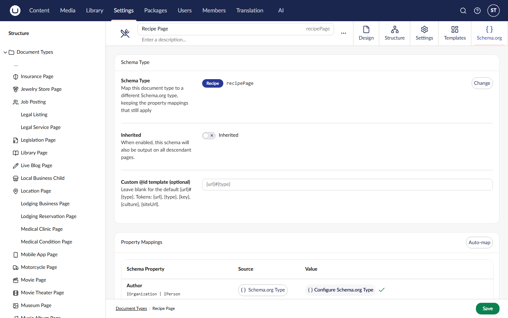

# The JSON-LD Output Model

This page explains what SchemeWeaver actually puts on your pages: the default `@graph` output, the pieces it is assembled from, how `@id` cross-references work, the site settings node that drives the site-level entities, and the legacy multi-script mode.

## The default: a single `@graph`

Out of the box (`SchemeWeaver:UseGraphModel` is `true`), SchemeWeaver emits **one** `<script type="application/ld+json">` element per page containing a Yoast-style graph: a single `@context` envelope holding an array of cross-referenced entities.

```json
{
  "@context": "https://schema.org",
  "@graph": [
    {
      "@type": "Organization",
      "@id": "https://example.com/#organization",
      "name": "Example Ltd",
      "logo": { "@type": "ImageObject", "url": "https://example.com/media/logo.png" }
    },
    {
      "@type": "WebSite",
      "@id": "https://example.com/#website",
      "name": "Example",
      "publisher": { "@id": "https://example.com/#organization" }
    },
    {
      "@type": "BreadcrumbList",
      "@id": "https://example.com/blog/my-post/#breadcrumb",
      "itemListElement": [ "..." ]
    },
    {
      "@type": "BlogPosting",
      "@id": "https://example.com/blog/my-post/#blogposting",
      "headline": "My Post",
      "isPartOf": { "@id": "https://example.com/#website" }
    }
  ]
}
```

This is the same shape Yoast SEO and Rank Math emit, and it is what modern SEO tooling expects: one graph, entities linked by `@id` rather than repeated inline.

The flag propagates everywhere: the tag helper, the Delivery API, the Examine index field and the backoffice JSON-LD preview all honour it, so the preview always shows what actually ships.

## Graph pieces

The graph is assembled from **pieces**, each responsible for one entity. A piece can decline to emit (for example, when there is nothing meaningful to say), and the graph degrades gracefully.

| Piece | Emits | `@id` convention | Skipped when |
|---|---|---|---|
| Organization | The site-wide `Organization` (or any Organization subtype such as `LocalBusiness`) built from the site settings node's mapping | `{siteUrl}#organization` | No settings node, no mapping on it, or its type is not an Organization subtype |
| WebSite | The `WebSite` entity, named from the root node or the settings node's `siteName`/`name` property, with `publisher` wired to the Organization | `{siteUrl}#website` | No resolvable site URL |
| BreadcrumbList | The breadcrumb trail for the current page, root-first with absolute URLs | `{pageUrl}#breadcrumb` | The page has no ancestors |
| PrimaryImage | An `ImageObject` for the page's primary image. The first published property aliased `primaryImage`, `heroImage`, `image`, `featuredImage` or `ogImage` wins | `{pageUrl}#primaryimage` | No matching property or no media in it |
| MainEntity | The current page's mapped Schema.org entity, built from your mapping exactly as described in [Property Mappings](property-mappings.md) | See [`@id` precedence](#id-precedence) below | The page's content type has no mapping |

When the main entity is a `WebPage` subtype (`FAQPage`, `AboutPage`, `ItemPage` and so on), SchemeWeaver auto-wires `isPartOf` to the WebSite, `breadcrumb` to the BreadcrumbList and `primaryImageOfPage` to the PrimaryImage, unless you have mapped those properties explicitly yourself.

Integrators can add their own pieces: implement `IGraphPiece` and register it in DI. See [Extending SchemeWeaver](extending.md).

## The site settings node

The Organization and WebSite pieces need somewhere to read your organisation's details from. That somewhere is a **site settings node**: a content node whose document type is mapped to `Organization` (or a subtype) like any other mapping.

Setting it up:

1. Create a document type with the alias `schemaSiteSettings` (or configure a different alias, below). Give it the properties you want in your Organization entity: name, logo, social profile URLs and so on.
2. Create and publish one node of that type. It can live at the content root or inside a settings folder; SchemeWeaver searches root nodes first, then their descendants.
3. Map the document type to `Organization` (or `LocalBusiness`, etc.) on its Schema.org tab, exactly as you would any page type.

From then on every page's graph carries your Organization and WebSite entities, cross-linked automatically.

If your settings node uses a different alias or you want to pin a specific node:

```json
{
  "SchemeWeaver": {
    "SiteSettings": {
      "ContentTypeAlias": "schemaSiteSettings",
      "ContentKey": null
    }
  }
}
```

`ContentKey` (a GUID) overrides the alias lookup entirely when set.

> **Why is my graph half empty?** If you see a graph with only the page entity and breadcrumb, the usual reason is that no site settings node exists (or it is unpublished, or its document type has no mapping). The Organization and WebSite pieces then skip themselves by design.

## Sitelinks search box

When the WebSite piece emits and `SchemeWeaver:SiteSearch:UrlTemplate` is configured, the `WebSite` entity gains a `potentialAction` `SearchAction`, the markup Google requires for the sitelinks search box:

```json
{
  "SchemeWeaver": {
    "SiteSearch": {
      "UrlTemplate": "https://example.com/search?q={search_term_string}",
      "QueryInputName": "search_term_string"
    }
  }
}
```

The template must be an absolute URL containing the literal `{search_term_string}` placeholder. `QueryInputName` rarely needs changing. Leave `UrlTemplate` unset (the default) and no `potentialAction` is emitted. Note that Google shows the sitelinks search box for relatively few sites; emitting the markup makes you eligible, it does not guarantee the feature.

## `@id` precedence

Every entity in the graph carries an `@id`. For the main entity the value is chosen in this order:

1. An explicit `Id` property mapping on the type, if you have one.
2. The mapping's **custom `@id` template**, set in the "Custom @id template" field on the Schema.org tab. Tokens: `{url}`, `{type}`, `{key}`, `{culture}`, `{siteUrl}`. For example `{siteUrl}#org-{key}`.
3. The default `{url}#{type}` (the page URL plus the lower-cased schema type as a fragment).

Custom `@id` templates matter when you need stable identifiers across cultures or want an entity's `@id` to match one published elsewhere (for example, a knowledge-graph URI).



## Inherited mappings and the Organization piece

Before the graph model existed, the common way to get an Organization onto every page was to map a settings-ish document type and switch on its **Inherited** toggle, which outputs the schema on all descendant pages. That still works, and remains the right tool for inheriting arbitrary schema down a subtree.

For the specific job of site-wide Organization and WebSite entities, prefer the site settings node: the graph pieces cross-link the entities properly (`publisher`, `isPartOf`) and avoid duplicating the Organization inline on every page. If you use both mechanisms with the same type you will get both entities, so pick one.

## Legacy mode: one script per source

Set `UseGraphModel` to `false` and SchemeWeaver reverts to emitting one `<script type="application/ld+json">` element per source of data, in this order:

1. **Inherited schemas** (root-first): mappings from ancestor content types marked Inherited.
2. **BreadcrumbList**: the auto-generated trail.
3. **Main page schema**: the mapping for the current node's document type.
4. **Block element schemas**: entities generated from mapped block elements, excluding blocks already covered by an explicit `blockContent` mapping.

Both modes are supported long-term; legacy mode suits consumers that want per-entity diffing or stricter CSP granularity.

> **Known issue**: `SchemeWeaver:EmitBreadcrumbsInDeliveryApi` currently only has an effect in legacy mode; under the default graph output the breadcrumb piece is emitted regardless. Tracked in [#81](https://github.com/EnjoyDigital/Umbraco.Community.Schemeweaver/issues/81).

## Configuration summary

```json
{
  "SchemeWeaver": {
    "UseGraphModel": true,
    "SiteSettings": { "ContentTypeAlias": "schemaSiteSettings", "ContentKey": null },
    "SiteSearch": { "UrlTemplate": null, "QueryInputName": "search_term_string" },
    "EmitBreadcrumbsInDeliveryApi": true
  }
}
```

The full configuration reference, including caching and recursion depth, lives in [Advanced Topics](advanced.md#configuration).

## Further reading

- [Quick Start for Developers](quickstart-developer.md)
- [Property Mappings](property-mappings.md) for how each entity's properties are resolved
- [Delivery API](delivery-api.md) for the headless shape of the same output
- [Language Variants](language-variants.md) for how culture affects URLs and `inLanguage`
- [Extending SchemeWeaver](extending.md) for custom graph pieces
