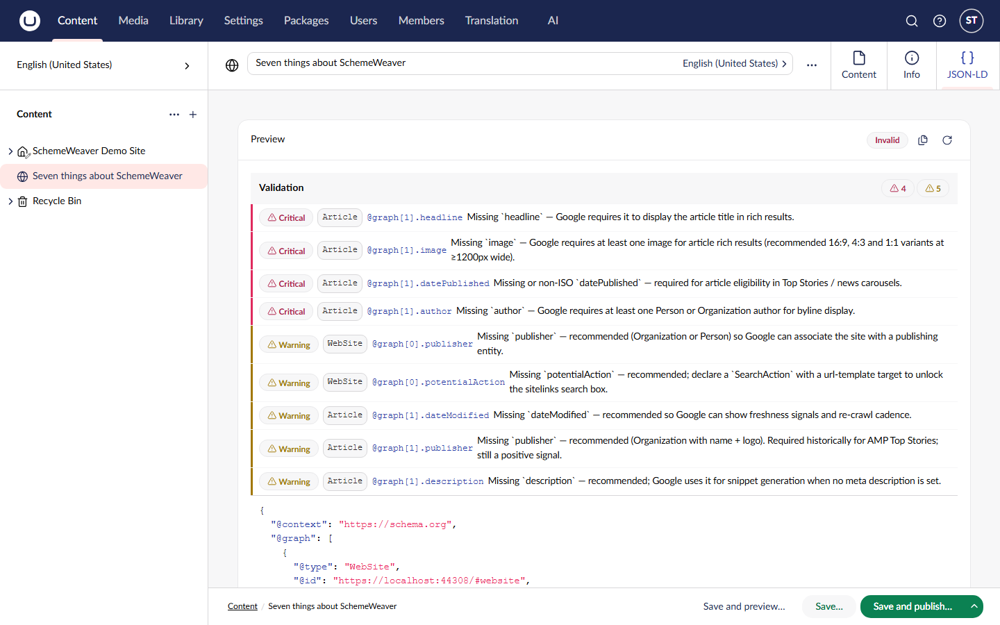

# Language Variants

SchemeWeaver is culture-aware end to end. If your site varies by culture, each variant gets JSON-LD built from that variant's values and URLs.

## How it works

- **Mappings are invariant.** There are no per-culture mapping rows: you map a document type once and the same mapping applies to every culture. Values are resolved at generation time for whichever culture is being rendered.
- **Server-rendered pages**: the tag helper reads the active culture from Umbraco's variation context automatically. A visitor on `/de/` gets JSON-LD built from the German property values with German URLs; no configuration needed.
- **`inLanguage` for free**: when a culture is active and your mapping does not explicitly map `inLanguage`, SchemeWeaver populates it from the culture code (for example `de-DE`).
- **URLs follow the culture**: entity `@id` values and mapped URL properties use the culture-correct URL for the node, including domain-per-language setups.
- **Related content**: parent, ancestor and sibling sources check for the property's existence invariantly, then resolve the value in the active culture.

## Backoffice preview

The JSON-LD tab on a content node follows the workspace's variant selector. Switch the editor to another culture and refresh the preview to see that variant's output, including its `inLanguage` and URLs.



## Delivery API

Both Delivery API routes accept a `culture` query parameter:

```
GET /umbraco/delivery/api/v2/schemeweaver/json-ld?id={key}&culture=de-DE
```

Omit it and the request falls back to the default culture resolution. Responses are cached per `(content key, culture)` pair, so variants never bleed into each other's cache entries. See [Delivery API](delivery-api.md) for the full endpoint reference.

## Things to check on multilingual sites

1. Publish the variant. Unpublished variants have no values to resolve.
2. If a property is set to vary by culture but a variant has no value, that property is simply omitted for that variant, exactly like an empty invariant property.
3. If you map `inLanguage` explicitly (for example to a static value), your mapping wins and the automatic culture value is not applied.

## Further reading

- [The JSON-LD Output Model](json-ld-output.md) for `@id` templates, including the `{culture}` token
- [Delivery API](delivery-api.md)
