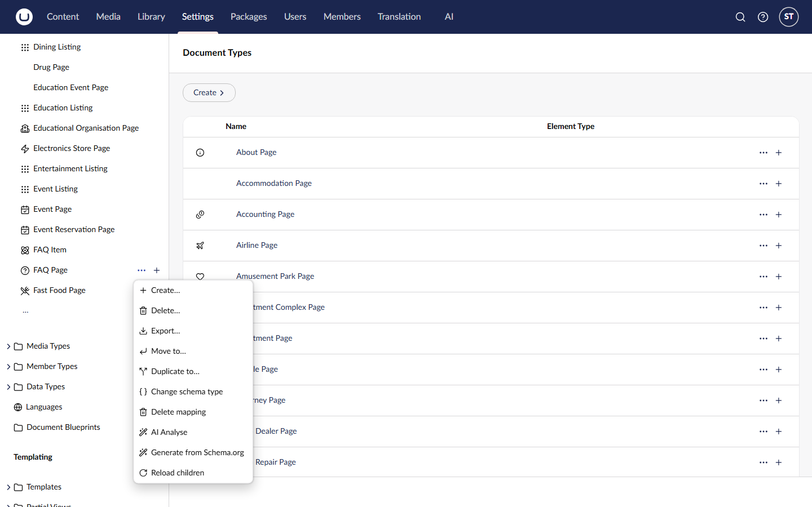
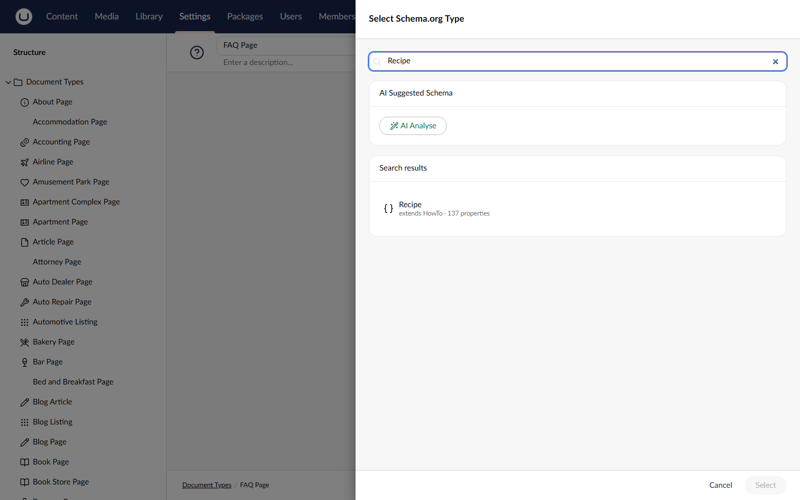
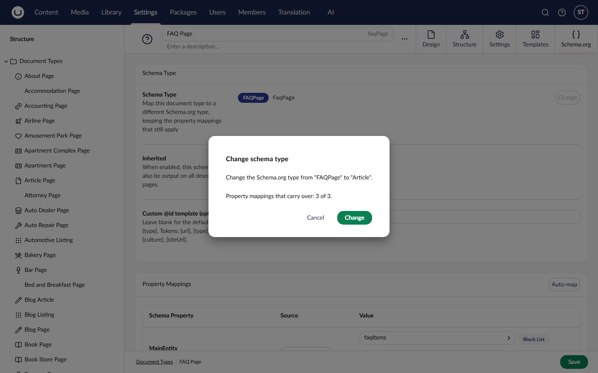

# Mapping Content Types

This guide covers the full process of mapping an Umbraco Content Type to a Schema.org type, from choosing the right schema to saving and managing your mappings.

## Overview

Each mapping connects exactly **one Umbraco Content Type** to **one Schema.org type**. Within that mapping, individual property mappings define where each schema property gets its value: from the current content node, a static string, a related node, block content, or a complex sub-type.

Mappings are created and maintained from the **Schema.org** tab in the document type editor. Open a document type under **Settings > Document Types**, switch to the Schema.org tab, and use **Map to Schema.org** to start a new mapping.

## Entity actions

SchemeWeaver adds four entity actions to every document type. They appear both in the tree context menu (the `...` next to a document type under **Settings > Document Types**) and in the workspace action menu of the document type editor:

| Action | Icon | Visible when |
|---|---|---|
| **Map to Schema.org** | `icon-brackets` | The document type has **no** mapping yet; starts a new mapping |
| **Change schema type** | `icon-brackets` | The document type **has** a mapping; switches it to a different Schema.org type (see [Changing the Schema.org type](#changing-the-schemaorg-type)) |
| **Delete mapping** | `icon-trash` | Always; removes the saved mapping |
| **Generate from Schema.org** | `icon-wand` | Always; scaffolds a new document type from a Schema.org type (see [Content Type Generation](content-type-generation.md)) |

With the optional [AI package](ai-integration.md) installed, two more actions appear: **AI Analyse** on each document type, and **AI Analyse All** on the Document Types tree root.

## Step 1: Choose a Schema.org type

When you begin a new mapping, the **Select Schema.org Type** modal opens, backed by the full vocabulary (around 800 types) discovered from the Schema.NET.Pending library at startup.

### Common types and search

The picker opens on a curated **Common types** shortlist covering the usual candidates (Article, BlogPosting, WebPage, Product, Event and so on). The search input filters the whole vocabulary instantly as you type; the results heading switches to **Search results**, and an overflow note ("Showing x of y matches") appears when there are more matches than the list shows, so keep typing to narrow. For example, typing "product" surfaces `Product`, `ProductGroup`, `ProductModel`, and related types.

### Type details

Each type in the list shows:

- **Name**: the Schema.org type name (e.g. `BlogPosting`).
- **Parent**: displayed as "extends [ParentType]" (e.g. "extends SocialMediaPosting").
- **Property count**: the number of properties defined for this type (including inherited properties).

### Selecting

Click a type to highlight it. The selected type is visually distinguished with a coloured background and border. Click **Select** in the modal footer to confirm your choice and proceed to property mapping. Click **Cancel** to close the modal without creating a mapping.

## Step 2: Review auto-mapped properties

After selecting a Schema.org type, a **property mapping modal** opens with auto-mapped suggestions.

SchemeWeaver's auto-mapper runs automatically, analysing your content type's properties and suggesting mappings to the schema's properties, each scored with a confidence from 0 to 100. The full scoring tiers (exact match, synonyms, built-in properties, popular defaults, partial matches) are documented in [Auto-Mapping Confidence Tiers](property-mappings.md#auto-mapping-confidence-tiers).

### Smart ordering

The property mapping table uses intelligent ordering to surface the most relevant properties:

1. **Popular Schema.org properties** appear first, in a fixed order: `name`, `headline`, `description`, `image`, `url`, `author`, `datePublished`, `dateModified`, `sku`, `price`.
2. **Mapped properties** (those with a content type property or static value assigned) come next, sorted by confidence score (highest first).

### Adding and removing properties

Only mapped properties (those with auto-mapped suggestions or manually configured values) are shown in the table. To add additional Schema.org properties, use the **Add property** combobox below the table. It presents all remaining schema properties grouped into Popular, Complex Type, and Other categories, with a search filter.

To remove a property row, hover over the schema property name and click the trash icon that appears. Removed properties can be re-added via the combobox at any time.

If no properties are mapped yet (for example, before auto-mapping runs), a hint message appears: "No properties are mapped yet."

### Property table columns

The mapping table has three columns:

| Column | Description |
|---|---|
| **Schema Property** | The Schema.org property name, with its expected type shown below. Complex editor types (Block List, Block Grid, Media Picker, Content Picker, Rich Text) show a badge. |
| **Source** | An icon and label indicating where the value comes from. Click to change via the source origin picker. |
| **Value** | A dropdown of available content type properties, a text input for static values, or nested type configuration, depending on the source type. Confidence tags (High/Medium/Low) appear alongside auto-mapped values. |

## Step 3: Adjust mappings

You can change any aspect of the suggested mappings before saving.

### Changing the source type

Click the source button on any property row to open the **Source Origin Picker** modal. The available source types are:

| Source type | Description |
|---|---|
| **Current Node** | Map from a property on the current content node. This is the default. Content Picker and Multi Node Tree Picker properties stay on this source and can emit their picked items in four "picked item value" modes (see [Content Picker Mappings](property-mappings.md#content-picker-mappings)). A Block List or Block Grid property in this mode emits its text-producing properties joined into one plain-text string (see [Basic Text Extraction](block-content.md#basic-text-extraction-property-mode)). |
| **Static Value** | Use a fixed text string that is the same for all content of this type. |
| **Parent Node** | Read a property from the direct parent node. Opens a content type picker to select which parent type, then shows its properties. |
| **Ancestor Node** | Walk up the content tree to find a value. Opens a content type picker. |
| **Sibling Node** | Read from a node at the same level. Opens a content type picker. |
| **Block Content** | Map from Block List or Block Grid items. Used for properties that contain structured repeated data (e.g. FAQ items, review ratings). |
| **Schema.org Type** | Build a complex nested type from multiple content type properties (e.g. map `author` to a `Person` with `name` and `email` sub-properties). |

An eighth source type, **Graph Reference** (`reference`), emits an `@id` reference to a shared graph piece; the picker offers it only on rows that already use one. See [Graph Reference](property-mappings.md#8-graph-reference-reference).

When you select Parent, Ancestor, or Sibling, a content type picker modal opens so you can specify which content type to read from. Once selected, the property dropdown updates to show that content type's properties.

### Changing the target property

For Current Node, Parent, Ancestor, and Sibling sources, use the property dropdown to select which Umbraco property to read. The dropdown shows all properties from the relevant content type (including built-in properties like `url`, `name`, `createDate`, and `updateDate`, which use a `__` prefix convention internally).

For Static Value, type the fixed string directly into the text input.

### Configuring block content and complex types

Block Content and Schema.org Type sources have additional configuration. These are covered in detail in the property mappings and block content guides.

## Step 4: Save the mapping

Click **Save** in the property mapping modal. SchemeWeaver persists the schema mapping immediately and shows a success notification. The Schema.org tab on the document type editor then shows the saved mapping inline.

Only property rows that have data are saved: rows where no content type property, static value, or resolver config has been set are excluded from the saved mapping.

## Editing existing mappings

To edit an existing mapping, navigate to the document type and switch to the **Schema.org** tab. If a mapping exists, the schema type name is shown as a tag and all property mappings are listed in the table. Edit the mappings inline and save the document type when you are done.

### Changing the Schema.org type

Picked `Article` and later decided `BlogPosting` fits better? Click **Change** next to the schema type tag. The picker opens on the type you are currently mapped to, and once you choose a different one SchemeWeaver works out what carries over:

- Every property mapping the new type also has is **kept exactly as it was**: source type, transform, related-node settings, block routes and nested type configuration included. Their Schema.org metadata (accepted types, whether the property takes an object) is refreshed to the new type.
- Property mappings the new type does not have **cannot** carry over, because the value would silently never be emitted. These are listed by name in a confirmation dialog before anything is saved, so you can cancel and reconsider.

The dialog tells you how many mappings will survive, e.g. *"14 of 16 property mappings will carry over."* Confirming saves the change immediately; there is no need to save the document type afterwards. Nothing is written if you cancel at either step.

Switching between related types usually loses nothing at all: `BlogPosting` derives from `Article`, so it inherits every one of Article's properties. Losses appear when you switch to an unrelated type, such as `Article` to `Recipe`.

After changing the type, **Auto-map** is a good next step: it fills in properties that are specific to the new type without touching the mappings you already made.

On an already-mapped document type, the actions menu offers **Change schema type** in place of Map to Schema.org (see [Entity actions](#entity-actions)); it opens this same flow rather than replacing your mappings with fresh auto-map suggestions.

On the workspace view, you can also click **Auto-map** to re-run the auto-mapper. This merges new suggestions with your existing mappings: if a property already has user-provided data (a content type property alias, static value, or resolver config), the user's choices are preserved and only the confidence score is updated. New schema properties from the suggestions are added as new rows.

## Inherited schemas toggle

On the workspace view, beneath the Schema Type display, there is an **Inherited** toggle switch with the description: "When enabled, this schema will also be output on all descendant pages."

When enabled:

- The JSON-LD for this mapping is output not only on pages of this content type, but also on every descendant page in the content tree, regardless of the descendant's own content type.
- Inherited schemas are rendered in root-first order, before the page's own schema and before the BreadcrumbList.

This is useful for organisation-level schemas. For example, you might map your "Site Settings" content type to `Organization` and mark it as inherited, so every page on the site includes the organisation's structured data. For site-wide Organization and WebSite entities specifically, the preferred mechanism is now the site settings node, which cross-links the graph entities properly; see [The JSON-LD Output Model](json-ld-output.md#the-site-settings-node).

## Deleting mappings

To delete a mapping, navigate to the document type in **Settings > Document Types**, click the **actions menu** (`...`), and select **Delete mapping**. The mapping and all its property mappings are removed from the database immediately. A success notification ("Mapping deleted successfully") confirms the action, and the Schema.org tab refreshes to show the content type as unmapped.

Deleting a mapping means published pages of that content type will no longer output JSON-LD for that schema type on their next render. Already-cached pages may still show the old output until they are re-rendered or the cache expires.

## Further reading

- **[Property Mappings](property-mappings.md)**: detailed guide to each source type, transforms, confidence scoring, and the property value resolver architecture.
- **[Block Content](block-content.md)**: mapping Block List and Block Grid editors to Schema.org types, including nested type configuration and the nested mapping modal.
- **[Getting Started](getting-started.md)**: installation, tag helper setup, and your first mapping walkthrough.
