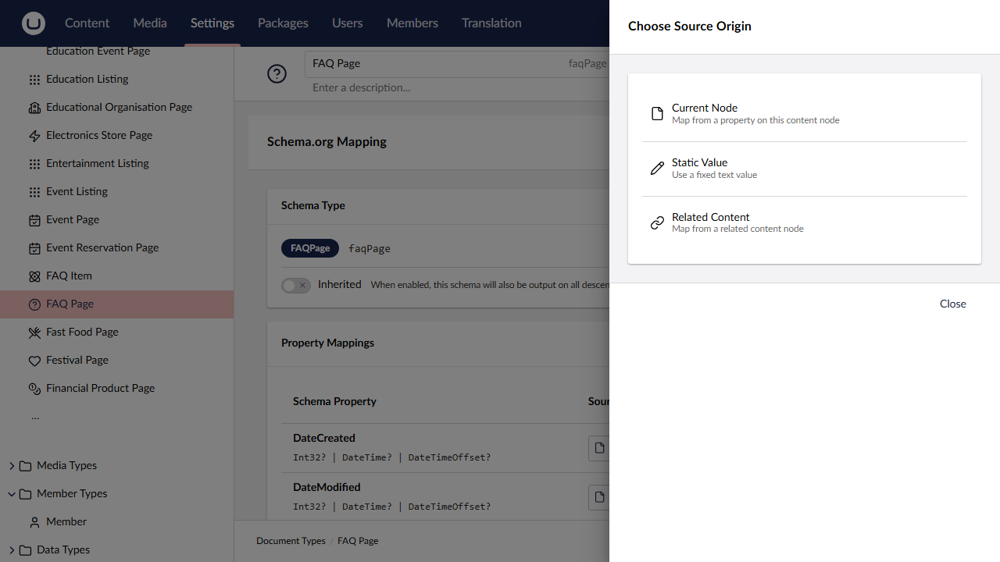
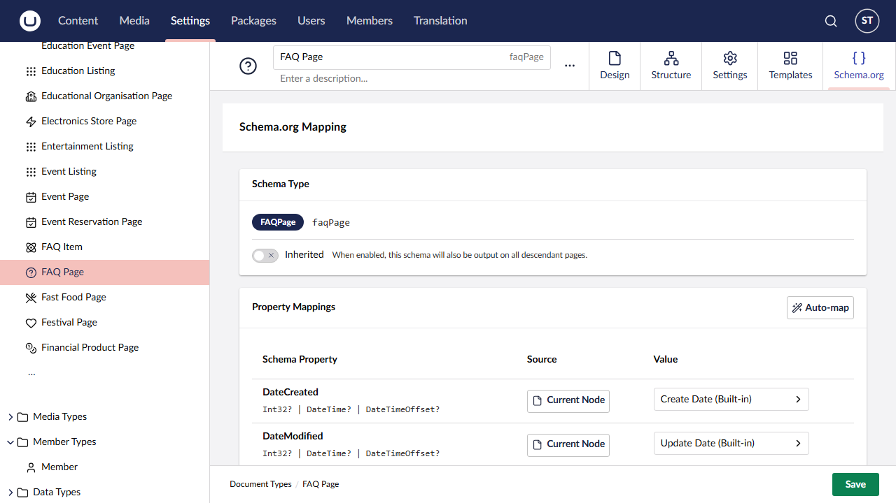

# Property Mappings

Property mappings are the core mechanism in SchemeWeaver for connecting Umbraco content type properties to Schema.org type properties. Each mapping defines **where** a value comes from (the source type), **which** property to read, and optionally **how** to transform it before it appears in the JSON-LD output.

This reference covers every source type, transform, the auto-mapping algorithm, built-in properties, and the property value resolver system.



---

## Source Types

SchemeWeaver supports seven source types. When you add or edit a property mapping, the source origin picker presents these options. The picker groups the three "related content" options (Parent, Ancestor, Sibling) behind a sub-menu.

### 1. Current Node (`property`)

Reads the value directly from the content node being rendered.

This is the most common source type. The property alias refers to any standard Umbraco property on the current document type, or one of the four built-in properties (see [Built-In Properties](#built-in-properties) below).

**Example:** Mapping `articleBody` to a Rich Text property called `bodyText` on a Blog Post document type.

### 2. Static Value (`static`)

Uses a hardcoded string value that you type in at mapping time. The value is emitted as-is in the JSON-LD output -- no property is read from any content node.

**Example:** Setting `priceCurrency` to `"GBP"` for a Product page, or `@type` sub-properties like `Organization.name` to your company name.

### 3. Parent Node (`parent`)

Reads from the direct parent of the content node being rendered. The resolution walks one level up the content tree using Umbraco's navigation query service.

**Example:** A Blog Post page reading `publisher` from its parent Blog Landing page, where the landing page holds the publisher's organisation name.

### 4. Ancestor Node (`ancestor`)

Walks up the content tree from the current node, checking each ancestor. You can optionally filter by **Source Content Type Alias** to target a specific document type in the tree.

If a content type alias filter is set, the resolver skips ancestors that do not match. If no filter is set, it returns the first ancestor where the requested property has a non-null value.

**Example:** Any page in the site reading `logo` from a "Site Settings" node at the root of the content tree, filtered by content type alias `siteSettings`.

### 5. Sibling Node (`sibling`)

Reads from a sibling node -- another child of the current node's parent. Like the ancestor source, you can optionally filter by **Source Content Type Alias**.

The resolver iterates through all children of the parent (excluding the current node itself) and returns the first sibling where the requested property has a non-null value.

**Example:** A Product page reading a shared "Brand Information" value from a sibling node of type `brandInfo` that sits alongside the product pages in the tree.

### 6. Block Content (`blockContent`)

Maps values from items within a BlockList or BlockGrid property. Each block element is resolved to a Schema.org Thing (or extracted as a string), enabling rich nested structured data from Umbraco's block editors.

This source type is shown in the picker only when the matched property uses a block editor (`Umbraco.BlockList` or `Umbraco.BlockGrid`) or when the schema property is a complex type.

For a comprehensive guide on configuring block content mappings, see [Block Content Mapping](block-content.md).

### 7. Complex Type (`complexType`)

Builds a nested Schema.org Thing with its own sub-property mappings. This is used for schema properties that expect a structured object rather than a simple value -- for example, `author` expecting a `Person`, or `address` expecting a `PostalAddress`.

Complex types are configured with a `ResolverConfig` JSON object containing a `complexTypeMappings` array. Each entry specifies a schema sub-property and either a content property alias (source type `property`) or a static value (source type `static`).

**Example:** Mapping `author` on an Article to a `Person` complex type, with sub-mappings for `name` from the content property `authorName` and `url` as a static value.

```json
{
  "complexTypeMappings": [
    {
      "schemaProperty": "name",
      "sourceType": "property",
      "contentTypePropertyAlias": "authorName"
    },
    {
      "schemaProperty": "url",
      "sourceType": "static",
      "staticValue": "https://example.com/about"
    }
  ]
}
```

This source type is shown in the picker only when the schema property is flagged as a complex type.

---

## Transforms

After a value is resolved, SchemeWeaver can apply a transform before writing it into the JSON-LD. Transforms apply only to string values; non-string values (numbers, booleans, Things) pass through unchanged. Empty or whitespace-only strings are discarded after transformation.

### `stripHtml`

Removes all HTML tags from the value using a regex pattern (`<[^>]+>`), then trims whitespace. Useful when mapping a Rich Text property to a schema property that expects plain text (e.g., `description`).

**Input:** `<p>A <strong>bold</strong> claim.</p>`
**Output:** `A bold claim.`

### `toAbsoluteUrl`

Converts a relative URL (starting with `/`) to an absolute URL by prepending the current request's scheme and host. Values that are already absolute (do not start with `/`) are returned unchanged.

**Input:** `/media/1001/hero.jpg`
**Output:** `https://www.example.com/media/1001/hero.jpg`

### `formatDate`

Parses the value as a date/time string and reformats it to `yyyy-MM-dd` (ISO 8601 date only). If parsing fails, the original value is returned unchanged.

**Input:** `2026-03-15T14:30:00+00:00`
**Output:** `2026-03-15`

---

## Auto-Mapping Confidence Tiers

When you trigger auto-mapping for a content type, SchemeWeaver's `SchemaAutoMapper` evaluates each Schema.org property against the content type's properties and assigns a confidence score. The algorithm runs through these tiers in order, stopping at the first match:

| Confidence | Tier | Description |
|:---:|---|---|
| **100** | Exact match | The content property alias matches the schema property name exactly (case-insensitive). E.g., `description` matches `description`. |
| **80** | Synonym match | The content property alias matches one of the known synonyms for the schema property. E.g., `bodyText` matches the synonym list for `articleBody` (`content`, `bodyText`, `richText`, `mainContent`, `body`). |
| **70** | Built-in property | The schema property matches a built-in IPublishedContent member. E.g., `url` maps to `__url`, `name` maps to `__name`, `datePublished` maps to `__createDate`, `dateModified` maps to `__updateDate`. This tier is used only when no custom property matched and the schema property is not a complex type. |
| **70** | Block editor / complex type inference | A content property was matched (exact, synonym, or partial) and the schema property is a complex type. If the matched editor is a block editor, the source type is upgraded to `blockContent` with appropriate nested configuration from the popular defaults table. |
| **60** | Popular schema default (no property match) | No content property matched, but a pre-built default exists for this schema type/property combination (e.g., `FAQPage.mainEntity`, `Product.review`). For `blockContent` defaults, this score is assigned only if a block editor property exists on the content type. For `complexType` defaults, it is assigned unconditionally. |
| **50** | Partial match | The content property alias contains the schema property name, or vice versa (case-insensitive substring). E.g., `blogTitle` partially matches `headline` because neither is a substring of the other -- but `pageTitle` would not match `headline` at this tier; it would need to be in the synonym list. |
| **0** | No match | No content property could be matched. The suggestion is returned with `isAutoMapped: false`. |

The UI displays confidence as badges: **High** (80 and above), **Medium** (50-79), and unmatched (0).

> **AI-Enhanced Mapping:** If the optional `Umbraco.Community.SchemeWeaver.AI` package is installed, the auto-map can use AI to semantically match properties beyond what the heuristic synonym dictionary covers. AI suggestions are merged with heuristic results -- for each property, the higher-confidence suggestion wins. See [AI Integration](ai-integration.md).

### Synonym Dictionary

The auto-mapper maintains an extensive synonym dictionary covering common Umbraco property naming patterns across many Schema.org domains. A selection of key entries:

| Schema.org Property | Recognised Synonyms |
|---|---|
| `name` | `title`, `heading`, `pageTitle`, `blogTitle`, `nodeName` |
| `description` | `metaDescription`, `excerpt`, `summary`, `intro` |
| `articleBody` | `content`, `bodyText`, `richText`, `mainContent`, `body` |
| `image` | `heroImage`, `mainImage`, `thumbnail`, `featuredImage`, `photo` |
| `datePublished` | `publishDate`, `createDate`, `articleDate`, `publishedDate` |
| `telephone` | `phone`, `phoneNumber`, `tel`, `contactNumber` |
| `recipeIngredient` | `ingredients`, `ingredientList` |
| `givenName` | `firstName`, `forename` |
| `jobTitle` | `role`, `position`, `title` |

The full dictionary covers General/Article, Product, Event, Recipe, LocalBusiness, Person, Video, Job Posting, Course, Software, Book, HowTo, Restaurant, and Organization domains.

### Popular Schema Defaults

For well-known schema type/property combinations, the auto-mapper provides pre-configured source types and resolver configurations. These are applied when a property is flagged as a complex type and either a block editor property is found or the default uses `complexType` as its source.

Key defaults include:

| Schema Type.Property | Source Type | Nested Type | Notes |
|---|---|---|---|
| `FAQPage.mainEntity` | `blockContent` | `Question` | Pre-configured with nested mappings for `name` and `acceptedAnswer` (wrapped in `Answer.Text`) |
| `Product.review` | `blockContent` | `Review` | Nested mappings for `author`, `reviewRating` (wrapped in `Rating.RatingValue`), and `reviewBody` |
| `Product.offers` | `complexType` | `Offer` | -- |
| `Recipe.recipeIngredient` | `blockContent` | -- | String extraction mode (`extractAs: "stringList"`) |
| `Recipe.recipeInstructions` | `blockContent` | `HowToStep` | Nested mappings for `name` and `text` |
| `Article.author` | `complexType` | `Person` | Also applied to `BlogPosting`, `NewsArticle`, `TechArticle` |
| `LocalBusiness.address` | `complexType` | `PostalAddress` | Also applied to `Restaurant` |

---

## Built-In Properties

SchemeWeaver exposes four built-in properties from `IPublishedContent` that are not accessible through Umbraco's standard `GetProperty()` mechanism. These use a double-underscore prefix convention to avoid collisions with custom property aliases.

| Alias | Display Name | Resolves To |
|---|---|---|
| `__url` | url | The content node's absolute URL, resolved via `IPublishedUrlProvider` with a request-context fallback |
| `__name` | name | The content node's `Name` property |
| `__createDate` | createDate | The content node's `CreateDate`, formatted as ISO 8601 with timezone (`yyyy-MM-ddTHH:mm:sszzz`) |
| `__updateDate` | updateDate | The content node's `UpdateDate`, formatted as ISO 8601 with timezone (`yyyy-MM-ddTHH:mm:sszzz`) |

Built-in properties are routed through the `BuiltInPropertyResolver` via a synthetic editor alias (`SchemeWeaver.BuiltIn`). They work with all source types -- you can read `__name` from the current node, a parent, an ancestor, or a sibling.

The auto-mapper uses these as a fallback when no custom property matches a schema property like `url`, `name`, `datePublished`, or `dateModified`.

---

## Property Value Resolvers

SchemeWeaver uses an extensible resolver architecture to extract values from Umbraco properties. The system works on two axes:

1. **WHERE** -- the source type determines which content node to read from (current, parent, ancestor, sibling)
2. **HOW** -- the resolver factory selects the appropriate `IPropertyValueResolver` based on the property's editor alias

### Resolver Factory

The `PropertyValueResolverFactory` collects all registered `IPropertyValueResolver` implementations from DI, indexed by their supported editor aliases. When multiple resolvers register for the same alias, the one with the highest `Priority` wins. If no resolver matches a given editor alias, the factory falls back to the `DefaultPropertyValueResolver`.

### Built-In Resolvers

| Resolver | Supported Editor Aliases | Priority | Behaviour |
|---|---|:---:|---|
| `BuiltInPropertyResolver` | `SchemeWeaver.BuiltIn` | 20 | Resolves `__url`, `__name`, `__createDate`, `__updateDate` from `IPublishedContent` members. URLs are resolved as absolute with a request-context fallback. Dates are formatted as ISO 8601 with timezone offset. |
| `BlockContentResolver` | `Umbraco.BlockList`, `Umbraco.BlockGrid` | 10 | Extracts block items and maps each to a Schema.NET Thing using nested mappings from `ResolverConfig` JSON. Supports string extraction mode. See [Block Content Mapping](block-content.md). |
| `MediaPickerResolver` | `Umbraco.MediaPicker3`, `Umbraco.MediaPicker` | 10 | Extracts the first media item's URL from the `umbracoFile` property. Handles `MediaWithCrops`, `ImageCropperValue`, and plain string paths. Returns an absolute URL. |
| `RichTextResolver` | `Umbraco.RichText`, `Umbraco.TinyMCE`, `Umbraco.MarkdownEditor` | 10 | Extracts HTML from `IHtmlEncodedString` (Rich Text/TinyMCE) or plain string (Markdown). Further transforms like `stripHtml` are applied by the generator. |
| `ContentPickerResolver` | `Umbraco.ContentPicker` | 10 | Returns the picked content's name by default. When a `NestedSchemaTypeName` is configured and recursion depth permits (max 3), generates a nested Thing from the picked content's own schema mapping. |
| `DateTimeResolver` | `Umbraco.DateTime` | 10 | Formats `DateTime` and `DateTimeOffset` values as ISO 8601 round-trip strings (`"o"` format). |
| `NumericResolver` | `Umbraco.Integer`, `Umbraco.Decimal` | 10 | Preserves the numeric type (`int`, `long`, `decimal`, `double`, `float`) so Schema.NET serialises it as a JSON number rather than a string. |
| `BooleanResolver` | `Umbraco.TrueFalse` | 10 | Preserves the boolean type. Also handles integer truthy values (`0` = false, non-zero = true). |
| `ColorPickerResolver` | `Umbraco.ColorPicker`, `Umbraco.ColorPicker.EyeDropper` | 10 | Extracts the colour value from `PickedColor` or a plain string, ensuring a `#` prefix. |
| `DropdownListResolver` | `Umbraco.DropDown.Flexible` | 10 | Handles the always-array return type of the flexible dropdown. Returns a single string for one selection, or a comma-separated string for multiple. |
| `MultipleTextStringResolver` | `Umbraco.MultipleTextstring` | 10 | Returns the string collection as a `List<string>`, which Schema.NET serialises as a JSON array. |
| `MultiUrlPickerResolver` | `Umbraco.MultiUrlPicker` | 10 | Extracts the first URL from `IEnumerable<Link>` or a single `Link`. Relative URLs are converted to absolute using the request context. |
| `TagsResolver` | `Umbraco.Tags` | 10 | Joins all tags into a single comma-separated string. |
| `DefaultPropertyValueResolver` | *(fallback -- empty aliases)* | 0 | Calls `GetValue()?.ToString()` as a catch-all for any unrecognised editor type. |

### Custom Resolvers

Third-party packages can register additional resolvers via dependency injection. Implement `IPropertyValueResolver`, return the editor aliases you handle from `SupportedEditorAliases`, and set `Priority` higher than 10 to override a built-in resolver. Register your implementation as a transient or scoped service of `IPropertyValueResolver` in your composer.



---

## Resolution Flow Summary

When SchemeWeaver generates JSON-LD for a published content node, each property mapping is resolved through this pipeline:

1. **Source type check** -- `complexType` creates a nested Thing directly; `static` returns the hardcoded value immediately.
2. **Target node resolution** -- Based on the source type, the generator locates the correct `IPublishedContent` node (current, parent, ancestor, or sibling).
3. **Built-in property check** -- If the property alias starts with `__`, the `BuiltInPropertyResolver` is used directly.
4. **Property lookup** -- `GetProperty()` is called on the target node to get the `IPublishedProperty`.
5. **Resolver selection** -- The `PropertyValueResolverFactory` selects the appropriate resolver based on the property's editor alias.
6. **Value resolution** -- The selected resolver extracts and converts the value.
7. **Transform application** -- If a transform is configured (`stripHtml`, `toAbsoluteUrl`, `formatDate`), it is applied to string values.
8. **Schema.NET assignment** -- The final value is set on the Schema.NET Thing instance using reflection-based property setting.
