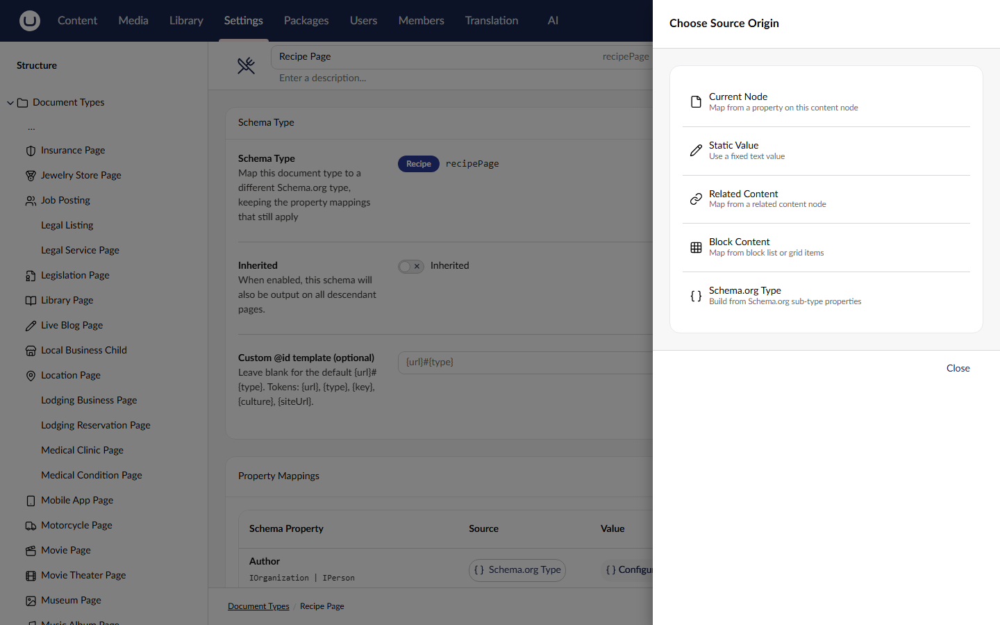
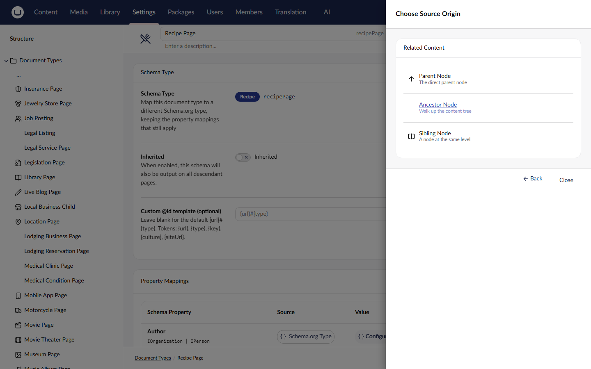
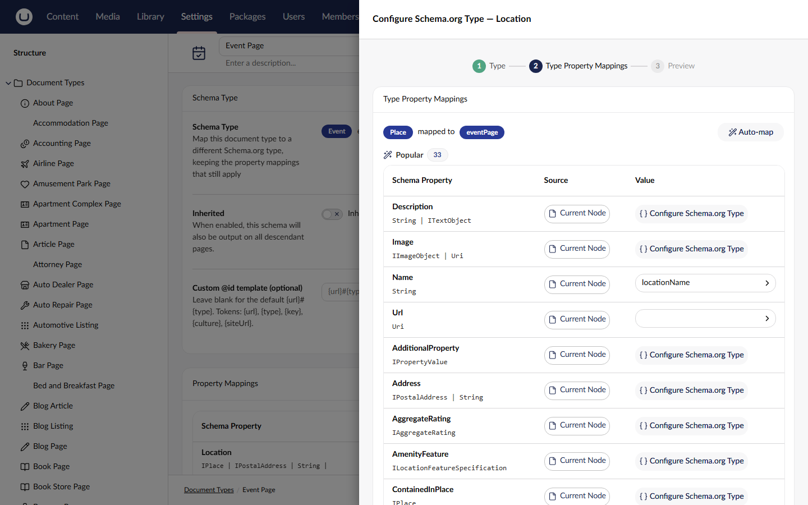

# Property Mappings

Property mappings are the core mechanism in SchemeWeaver for connecting Umbraco content type properties to Schema.org type properties. Each mapping defines **where** a value comes from (the source type), **which** property to read, and optionally **how** to transform it before it appears in the JSON-LD output.

This reference covers every source type, transform, the auto-mapping algorithm, built-in properties, and the property value resolver system.


---

## Source Types

SchemeWeaver supports eight source types. When you add or edit a property mapping, the source origin picker presents these options. The picker groups the three "related content" options (Parent, Ancestor, Sibling) behind a sub-menu.





### 1. Current Node (`property`)

Reads the value directly from the content node being rendered.

This is the most common source type. The property alias refers to any standard Umbraco property on the current document type, or one of the four built-in properties (see [Built-In Properties](#built-in-properties) below).

**Example:** Mapping `articleBody` to a Rich Text property called `bodyText` on a Blog Post document type.

Content Picker and Multi Node Tree Picker properties also stay on this source type: they are references to other nodes, and what they emit is controlled by `ResolverConfig` and `NestedSchemaTypeName`. See [Content Picker Mappings](#content-picker-mappings).

Block List and Block Grid properties can also be mapped on this source type. With no block configuration, the resolver degrades to **basic text extraction**: it walks the block items (including nested blocks and grid areas), pulls out the text-producing properties (Textstring, Textarea, Rich Text, Markdown), strips any HTML, and emits the fragments joined into a single plain-text string. This suits plain-text targets such as `description` or `articleBody`; for structured output per block, use the [Block Content source type](block-content.md) instead. When a block editor in this mode feeds a target property that expects structured objects, validation raises a suggestion (the PreferBlockContent advisory).

### 2. Static Value (`static`)

Uses a hardcoded string value that you type in at mapping time. The value is emitted as-is in the JSON-LD output; no property is read from any content node.

**Example:** Setting `priceCurrency` to `"GBP"` for a Product page, or `@type` sub-properties like `Organization.name` to your company name.

### 3. Parent Node (`parent`)

Reads from the direct parent of the content node being rendered. The resolution walks one level up the content tree using Umbraco's navigation query service.

**Example:** A Blog Post page reading `publisher` from its parent Blog Landing page, where the landing page holds the publisher's organisation name.

### 4. Ancestor Node (`ancestor`)

Walks up the content tree from the current node, checking each ancestor. You can optionally filter by **Source Content Type Alias** to target a specific document type in the tree.

If a content type alias filter is set, the resolver skips ancestors that do not match. If no filter is set, it returns the first ancestor where the requested property has a non-null value.

**Example:** Any page in the site reading `logo` from a "Site Settings" node at the root of the content tree, filtered by content type alias `siteSettings`.

### 5. Sibling Node (`sibling`)

Reads from a sibling node, another child of the current node's parent. Like the ancestor source, you can optionally filter by **Source Content Type Alias**.

The resolver iterates through all children of the parent (excluding the current node itself) and returns the first sibling where the requested property has a non-null value.

**Example:** A Product page reading a shared "Brand Information" value from a sibling node of type `brandInfo` that sits alongside the product pages in the tree.

### 6. Block Content (`blockContent`)

Maps values from items within a BlockList or BlockGrid property. Each block element is resolved to a Schema.org Thing (or extracted as a string), enabling rich nested structured data from Umbraco's block editors.

This source type is shown in the picker only when the matched property uses a block editor (`Umbraco.BlockList` or `Umbraco.BlockGrid`) or when the schema property is a complex type.

For a comprehensive guide on configuring block content mappings, see [Block Content Mapping](block-content.md).

### 7. Complex Type (`complexType`)



Builds a nested Schema.org Thing with its own sub-property mappings. This is used for schema properties that expect a structured object rather than a simple value: for example, `author` expecting a `Person`, or `address` expecting a `PostalAddress`.

Complex types are configured with a `ResolverConfig` JSON object containing a `complexTypeMappings` array. Each entry (a **sub-row**) names a schema sub-property and says where its value comes from.

#### Sub-row fields

| Field | Description |
|---|---|
| `schemaProperty` | The sub-property to set on the nested Thing (e.g. `name`, `logo`) |
| `sourceType` | `property`, `static`, `parent`, `ancestor`, `sibling`, or `complexType` |
| `contentTypePropertyAlias` | Property alias to read (for `property`/`parent`/`ancestor`/`sibling`); built-ins such as `__name` and `__url` are allowed |
| `staticValue` | Fixed value (for `static`) |
| `sourceContentTypeAlias` | Content type filter for `ancestor`/`sibling` |
| `transformType` | `stripHtml`, `toAbsoluteUrl` or `formatDate`, applied to node-sourced string sub-values only (`static` sub-values are never transformed) |
| `resolverConfig` | Nested JSON config: another `complexTypeMappings` object for `complexType` sub-rows, or picked-item config when the sub-row's property is a content picker (see [Content Picker Mappings](#content-picker-mappings)) |

Sub-rows are resolved through the same resolver pipeline as top-level mappings, so a media picker sub-row yields an `ImageObject`, a DateTime formats as ISO 8601, and a content picker sub-row can be drilled or nested.

**Related-node sub-rows.** `parent`, `ancestor` and `sibling` sub-rows locate their target node exactly as a top-level related mapping would, which is what lets an inline `Organization` read its `name` and `logo` from the site root. They resolve relative to the **page being generated**, at every nesting depth. There is one exception: inside a per-usage picked object (`pickedComplexType`, see below) the base node is the **picked node**, so those sub-rows walk the picked node's branch of the tree instead.

**Nested complex types.** A `complexType` sub-row carries its own `complexTypeMappings` in its `resolverConfig` (with a `selectedSubType` naming the inner type) and recurses: e.g. `Organization.address` as a `PostalAddress` inside an inline `Organization`. Config nesting does not advance the recursion-depth counter (that counter bounds *node* hops), because the JSON structure is finite by definition.

**Empty-shell guard.** If no sub-row resolves a value, or every value is dropped by type conversion, the nested Thing is omitted entirely rather than emitting an invalid `{"@type":"Person"}` shell.

**Example:** Mapping `author` on an Article to a `Person` complex type, with sub-mappings for `name` from the content property `authorName` and `url` as a static value.

```json
{
  "complexTypeMappings": [
    {
      "schemaProperty": "name",
      "sourceType": "property",
      "contentTypePropertyAlias": "authorName"
    },
    {
      "schemaProperty": "url",
      "sourceType": "static",
      "staticValue": "https://example.com/about"
    }
  ]
}
```

This source type is shown in the picker only when the schema property is flagged as a complex type.

### 8. Graph Reference (`reference`)

A `reference` row does not resolve a value from content at all. Its value is an `@id` reference to a shared **graph piece**: an entity defined once elsewhere in the page's `@graph`, such as the site-wide Organization. At render time the row emits a range-typed shell containing just that identifier, for example `{"@id": "https://example.com/#organization"}` as the value of `publisher`, pointing at the entity where it is fully defined.

References are resolved from the graph being assembled, so they only produce output in the default graph output model; in the legacy separate-scripts mode the row is skipped. See [The JSON-LD Output Model](json-ld-output.md) for graph pieces, their `@id` conventions and the site settings node.

Reference rows are normally created for you (by auto-mapping, uSync import or the MCP tools) rather than configured by hand: the source origin picker shows a **Graph Reference** option only on a row that already uses one, so re-picking the source keeps the reference intact.

---

## Content Picker Mappings

A **Content Picker** (`Umbraco.ContentPicker`) or **Multi Node Tree Picker** (`Umbraco.MultiNodeTreePicker`) property is a *reference* to another node rather than a value of its own. Such a property stays on the `property` source type; what it emits is decided by the mapping's `NestedSchemaTypeName` and `ResolverConfig`.

Each picked node runs through a **four-rung precedence ladder**; the first configured rung wins:

| Rung | Mode | Configured by | Emits |
|:---:|---|---|---|
| 1 | **Drill-down** | `ResolverConfig` `pickedPropertyAlias` | The value of ONE property read off the picked node |
| 2 | **Per-usage object** | `ResolverConfig` `pickedComplexType` (+ `NestedSchemaTypeName`) | An inline Schema.org object built from the picked node's properties |
| 3 | **Whole item** | `NestedSchemaTypeName` alone | The picked node rendered via its own content type's saved mapping |
| 4 | **Fallback** | *(nothing configured)* | The picked node's `Name` |

Rungs 1 and 2 deliberately **do not** fall back to the node name. An explicitly configured drill or object that resolves nothing emits nothing: substituting a bare string would either be dropped by the property setter or auto-wrapped into a fabricated Thing.

### 1. Drill-down

```json
{ "pickedPropertyAlias": "jobTitle", "pickedContentTypeAlias": "authorProfile" }
```

Reads a single property off the picked node through the **full value pipeline**, so a drilled Media Picker yields an `ImageObject`, a DateTime formats as ISO 8601, and the [built-in properties](#built-in-properties) (`__name`, `__url`, `__createDate`, `__updateDate`) resolve against the *picked* node rather than the page.

`pickedContentTypeAlias` is a **backoffice UI hint only** (it tells the property picker whose properties to list) and is never consulted at render time: the alias is read off whatever node was actually picked.

Because the render emits that single property's value, a configured drill-down also suppresses the range validator's check on `NestedSchemaTypeName`: the chosen object type is ignored at render time, so warning about it would flag output that never happens.

### 2. Per-usage object

```json
{
  "pickedComplexType": {
    "selectedSubType": "Person",
    "complexTypeMappings": [
      { "schemaProperty": "name", "sourceType": "property", "contentTypePropertyAlias": "fullName" },
      { "schemaProperty": "jobTitle", "sourceType": "property", "contentTypePropertyAlias": "jobTitle" },
      { "schemaProperty": "image", "sourceType": "property", "contentTypePropertyAlias": "photo" },
      { "schemaProperty": "url", "sourceType": "property", "contentTypePropertyAlias": "__url" }
    ]
  }
}
```

Builds an inline Schema.org object using the same `complexTypeMappings` shape as the [Complex Type](#7-complex-type-complextype) source, except that every sub-row reads the **picked node's** properties. The picked content type needs no mapping of its own, so the same picked type can be shaped differently on different pages: an `authorProfile` can be a full `Person` on an article and just a `name` elsewhere.

Set the row's `NestedSchemaTypeName` to the same type as well. It is what the range validator checks against the schema property's accepted types, and at render time it takes precedence over `selectedSubType`.

Inside a per-usage object the base node has moved, so `parent`, `ancestor` and `sibling` sub-rows resolve **relative to the picked node**, not to the page being generated. Everywhere else, related-node sub-rows are page-relative.

The key is deliberately nested under `pickedComplexType` rather than hoisting `complexTypeMappings` to the top level: that key already means "resolve against *this* node" for `complexType` and `blockContent` rows, and reusing it would let a source-type switch silently re-base the object onto the page. The key names the base node.

### 3. Whole item

Set `NestedSchemaTypeName` and leave both picked-item keys out of `ResolverConfig`. The picked node is rendered as a nested Thing by replaying **its own content type's saved SchemaMapping** through the resolver pipeline: one definition, reused everywhere that type is picked.

If the picked type has no mapping, or its mapping lands nothing (for example the outer `NestedSchemaTypeName` disagrees with the picked type's own schema type, so every value is dropped by the setter), the whole-item rung yields nothing and resolution falls through to rung 4: the node's name, which is at least true.

Cycles and runaway nesting are bounded by the `MaxRecursionDepth` setting (default 3) and by a visited-node set, so an A-picks-B, B-picks-A arrangement terminates by degrading to a name.

### Multi Node Tree Picker fan-out

Every picked node runs the same ladder. A single pick returns its value directly (parity with the single content picker); several picks return a **list**.

Because `SchemaPropertySetter` only binds `IEnumerable<Thing>` or `IEnumerable<string>`, a mixed list is **homogenised**: if any item resolved to a Thing, the Things are kept and the loose strings are dropped; otherwise everything is converted to strings. A `List<object>` would match neither binding and be dropped wholesale, so this is a deterministic partial result rather than silence. Keep one mode per row rather than relying on a partial config.

A picked item that throws is skipped individually: one bad node never breaks the rest of the list, or the page.

### Pickers as complex-type sub-rows

A `complexTypeMappings` sub-row whose `contentTypePropertyAlias` is itself a picker takes the same picked-item config, carried in the **sub-row's own** `resolverConfig` string:

```json
{
  "complexTypeMappings": [
    {
      "schemaProperty": "jobTitle",
      "sourceType": "property",
      "contentTypePropertyAlias": "authorNode",
      "resolverConfig": "{\"pickedPropertyAlias\":\"jobTitle\"}"
    },
    {
      "schemaProperty": "worksFor",
      "sourceType": "property",
      "contentTypePropertyAlias": "employerNode",
      "resolverConfig": "{\"nestedSchemaTypeName\":\"Organization\"}"
    }
  ]
}
```

A `ComplexTypeMappingEntry` has no `NestedSchemaTypeName` field of its own, so for a sub-row the whole-item type name travels **inside** `resolverConfig` as `nestedSchemaTypeName`. Without either key the sub-row emits only the picked node's name.

This forwarding is gated on the property's editor alias, so a stale `complexType` or `blockContent` config left on a non-picker sub-row can never reach the picker resolver.

---

## Transforms

After a value is resolved, SchemeWeaver can apply a transform before writing it into the JSON-LD. Transforms apply only to string values; non-string values (numbers, booleans, Things) pass through unchanged. Empty or whitespace-only strings are discarded after transformation.

### `stripHtml`

Removes all HTML tags from the value using a regex pattern (`<[^>]+>`), then trims whitespace. Useful when mapping a Rich Text property to a schema property that expects plain text (e.g., `description`).

**Input:** `<p>A <strong>bold</strong> claim.</p>`
**Output:** `A bold claim.`

### `toAbsoluteUrl`

Converts a relative URL (starting with `/`) to an absolute URL by prepending the current request's scheme and host. Values that are already absolute (do not start with `/`) are returned unchanged.

**Input:** `/media/1001/hero.jpg`
**Output:** `https://www.example.com/media/1001/hero.jpg`

### `formatDate`

Parses the value as a date/time string and reformats it to `yyyy-MM-dd` (ISO 8601 date only). If parsing fails, the original value is returned unchanged.

**Input:** `2026-03-15T14:30:00+00:00`
**Output:** `2026-03-15`

---

## Auto-Mapping Confidence Tiers

When you trigger auto-mapping for a content type, SchemeWeaver's `SchemaAutoMapper` evaluates each Schema.org property against the content type's properties and assigns a confidence score. The algorithm runs through these tiers in order, stopping at the first match:

| Confidence | Tier | Description |
|:---:|---|---|
| **100** | Exact match | The content property alias matches the schema property name exactly (case-insensitive). E.g., `description` matches `description`. |
| **80** | Synonym match | The content property alias matches one of the known synonyms for the schema property. E.g., `bodyText` matches the synonym list for `articleBody` (`content`, `bodyText`, `richText`, `mainContent`, `body`). |
| **70** | Built-in property | The schema property matches a built-in IPublishedContent member. E.g., `url` maps to `__url`, `name` maps to `__name`, `datePublished` maps to `__createDate`, `dateModified` maps to `__updateDate`. This tier is used only when no custom property matched and the schema property is not a complex type. |
| **70** | Block editor / complex type inference | A content property was matched (exact, synonym, or partial) and the schema property is a complex type. If the matched editor is a block editor, the source type is upgraded to `blockContent` with appropriate nested configuration from the popular defaults table. |
| **60** | Popular schema default (no property match) | No content property matched, but a pre-built default exists for this schema type/property combination (e.g., `FAQPage.mainEntity`, `Product.review`). For `blockContent` defaults, this score is assigned only if a block editor property exists on the content type. For `complexType` defaults, it is assigned unconditionally. |
| **50** | Partial match | The content property alias contains the schema property name, or vice versa (case-insensitive substring). E.g., `blogTitle` partially matches `headline` because neither is a substring of the other; but `pageTitle` would not match `headline` at this tier; it would need to be in the synonym list. |
| **0** | No match | No content property could be matched. The suggestion is returned with `isAutoMapped: false`. |

The UI displays confidence as badges: **High** (80 and above), **Medium** (50-79), and unmatched (0).

### Synonym Dictionary

The auto-mapper maintains an extensive synonym dictionary covering common Umbraco property naming patterns across many Schema.org domains. A selection of key entries:

| Schema.org Property | Recognised Synonyms |
|---|---|
| `name` | `title`, `heading`, `pageTitle`, `blogTitle`, `nodeName` |
| `description` | `metaDescription`, `excerpt`, `summary`, `intro` |
| `articleBody` | `content`, `bodyText`, `richText`, `mainContent`, `body` |
| `image` | `heroImage`, `mainImage`, `thumbnail`, `featuredImage`, `photo` |
| `datePublished` | `publishDate`, `createDate`, `articleDate`, `publishedDate` |
| `telephone` | `phone`, `phoneNumber`, `tel`, `contactNumber` |
| `recipeIngredient` | `ingredients`, `ingredientList` |
| `givenName` | `firstName`, `forename` |
| `jobTitle` | `role`, `position`, `title` |

The full dictionary covers General/Article, Product, Event, Recipe, LocalBusiness, Person, Video, Job Posting, Course, Software, Book, HowTo, Restaurant, and Organization domains.

### Popular Schema Defaults

For well-known schema type/property combinations, the auto-mapper provides pre-configured source types and resolver configurations. These are applied when a property is flagged as a complex type and either a block editor property is found or the default uses `complexType` as its source.

Key defaults include:

| Schema Type.Property | Source Type | Nested Type | Notes |
|---|---|---|---|
| `FAQPage.mainEntity` | `blockContent` | `Question` | Pre-configured with nested mappings for `name` and `acceptedAnswer` (wrapped in `Answer.Text`) |
| `Product.review` | `blockContent` | `Review` | Nested mappings for `author`, `reviewRating` (wrapped in `Rating.RatingValue`), and `reviewBody` |
| `Product.offers` | `complexType` | `Offer` | *(none)* |
| `Recipe.recipeIngredient` | `blockContent` | *(none)* | String extraction mode (`extractAs: "stringList"`) |
| `Recipe.recipeInstructions` | `blockContent` | `HowToStep` | Nested mappings for `name` and `text` |
| `Article.author` | `complexType` | `Person` | Also applied to `BlogPosting`, `NewsArticle`, `TechArticle` |
| `LocalBusiness.address` | `complexType` | `PostalAddress` | Also applied to `Restaurant` |

---

## Built-In Properties

SchemeWeaver exposes four built-in properties from `IPublishedContent` that are not accessible through Umbraco's standard `GetProperty()` mechanism. These use a double-underscore prefix convention to avoid collisions with custom property aliases.

| Alias | Display Name | Resolves To |
|---|---|---|
| `__url` | url | The content node's absolute URL, resolved via `IPublishedUrlProvider` with a request-context fallback |
| `__name` | name | The content node's `Name` property |
| `__createDate` | createDate | The content node's `CreateDate`, formatted as ISO 8601 with timezone (`yyyy-MM-ddTHH:mm:sszzz`) |
| `__updateDate` | updateDate | The content node's `UpdateDate`, formatted as ISO 8601 with timezone (`yyyy-MM-ddTHH:mm:sszzz`) |

Built-in properties are routed through the `BuiltInPropertyResolver` via a synthetic editor alias (`SchemeWeaver.BuiltIn`). They work with all node-reading source types: you can read `__name` from the current node, a parent, an ancestor, or a sibling.

The auto-mapper uses these as a fallback when no custom property matches a schema property like `url`, `name`, `datePublished`, or `dateModified`.

---

## Property Value Resolvers

SchemeWeaver uses an extensible resolver architecture to extract values from Umbraco properties. The system works on two axes:

1. **WHERE**: the source type determines which content node to read from (current, parent, ancestor, sibling)
2. **HOW**: the resolver factory selects the appropriate `IPropertyValueResolver` based on the property's editor alias

### Resolver Factory

The `PropertyValueResolverFactory` collects all registered `IPropertyValueResolver` implementations from DI, indexed by their supported editor aliases. When multiple resolvers register for the same alias, the one with the highest `Priority` wins. If no resolver matches a given editor alias, the factory falls back to the `DefaultPropertyValueResolver`.

### Built-In Resolvers

| Resolver | Supported Editor Aliases | Priority | Behaviour |
|---|---|:---:|---|
| `BuiltInPropertyResolver` | `SchemeWeaver.BuiltIn` | 20 | Resolves `__url`, `__name`, `__createDate`, `__updateDate` from `IPublishedContent` members. URLs are resolved as absolute with a request-context fallback. Dates are formatted as ISO 8601 with timezone offset. |
| `BlockContentResolver` | `Umbraco.BlockList`, `Umbraco.BlockGrid` | 10 | Extracts block items and maps each to a Schema.NET Thing using nested mappings from `ResolverConfig` JSON. Supports string extraction mode. See [Block Content Mapping](block-content.md). |
| `MediaPickerResolver` | `Umbraco.MediaPicker3`, `Umbraco.MediaPicker` | 10 | Extracts the first media item's URL from the `umbracoFile` property. Handles `MediaWithCrops`, `ImageCropperValue`, and plain string paths. Returns an absolute URL. |
| `RichTextResolver` | `Umbraco.RichText`, `Umbraco.TinyMCE`, `Umbraco.MarkdownEditor` | 10 | Extracts HTML from `IHtmlEncodedString` (Rich Text/TinyMCE) or plain string (Markdown). Further transforms like `stripHtml` are applied by the generator. |
| `ContentPickerResolver` | `Umbraco.ContentPicker` | 10 | Resolves the picked node through the shared four-rung ladder: drill-down (`ResolverConfig` `pickedPropertyAlias`), per-usage object (`pickedComplexType`), whole-item nesting (`NestedSchemaTypeName` + the picked type's own schema mapping), then the node's `Name`. Bounded by `MaxRecursionDepth` and a visited-node set. See [Content Picker Mappings](#content-picker-mappings). |
| `MultiNodeTreePickerResolver` | `Umbraco.MultiNodeTreePicker` | 10 | Runs every picked node through the same ladder as `ContentPickerResolver`. A single pick returns its value directly; several picks return a homogenised list (Things preferred, loose strings dropped when any Thing is present). An item that fails is skipped rather than breaking the list. |
| `DateTimeResolver` | `Umbraco.DateTime` | 10 | Formats `DateTime` and `DateTimeOffset` values as ISO 8601 round-trip strings (`"o"` format). |
| `NumericResolver` | `Umbraco.Integer`, `Umbraco.Decimal` | 10 | Preserves the numeric type (`int`, `long`, `decimal`, `double`, `float`) so Schema.NET serialises it as a JSON number rather than a string. |
| `BooleanResolver` | `Umbraco.TrueFalse` | 10 | Preserves the boolean type. Also handles integer truthy values (`0` = false, non-zero = true). |
| `ColorPickerResolver` | `Umbraco.ColorPicker`, `Umbraco.ColorPicker.EyeDropper` | 10 | Extracts the colour value from `PickedColor` or a plain string, ensuring a `#` prefix. |
| `DropdownListResolver` | `Umbraco.DropDown.Flexible` | 10 | Handles the always-array return type of the flexible dropdown. Returns a single string for one selection, or a comma-separated string for multiple. |
| `MultipleTextStringResolver` | `Umbraco.MultipleTextstring` | 10 | Returns the string collection as a `List<string>`, which Schema.NET serialises as a JSON array. |
| `MultiUrlPickerResolver` | `Umbraco.MultiUrlPicker` | 10 | Extracts the first URL from `IEnumerable<Link>` or a single `Link`. Relative URLs are converted to absolute using the request context. |
| `TagsResolver` | `Umbraco.Tags` | 10 | Joins all tags into a single comma-separated string. |
| `DefaultPropertyValueResolver` | *(fallback: empty aliases)* | 0 | Calls `GetValue()?.ToString()` as a catch-all for any unrecognised editor type. |

### Custom Resolvers

Third-party packages can register additional resolvers via dependency injection. Implement `IPropertyValueResolver`, return the editor aliases you handle from `SupportedEditorAliases`, and set `Priority` higher than 10 to override a built-in resolver. Register your implementation as a transient or scoped service of `IPropertyValueResolver` in your composer.


---

## Resolution Flow Summary

When SchemeWeaver generates JSON-LD for a published content node, each property mapping is resolved through this pipeline:

1. **Source type check**: `complexType` creates a nested Thing directly; `static` returns the hardcoded value immediately; `reference` short-circuits to an `@id` shell resolved from the graph context (see [Graph Reference](#8-graph-reference-reference)).
2. **Target node resolution**: Based on the source type, the generator locates the correct `IPublishedContent` node (current, parent, ancestor, or sibling).
3. **Built-in property check**: If the property alias starts with `__`, the `BuiltInPropertyResolver` is used directly.
4. **Property lookup**: `GetProperty()` is called on the target node to get the `IPublishedProperty`.
5. **Resolver selection**: The `PropertyValueResolverFactory` selects the appropriate resolver based on the property's editor alias.
6. **Value resolution**: The selected resolver extracts and converts the value.
7. **Transform application**: If a transform is configured (`stripHtml`, `toAbsoluteUrl`, `formatDate`), it is applied to string values.
8. **Schema.NET assignment**: The final value is set on the Schema.NET Thing instance using reflection-based property setting.
