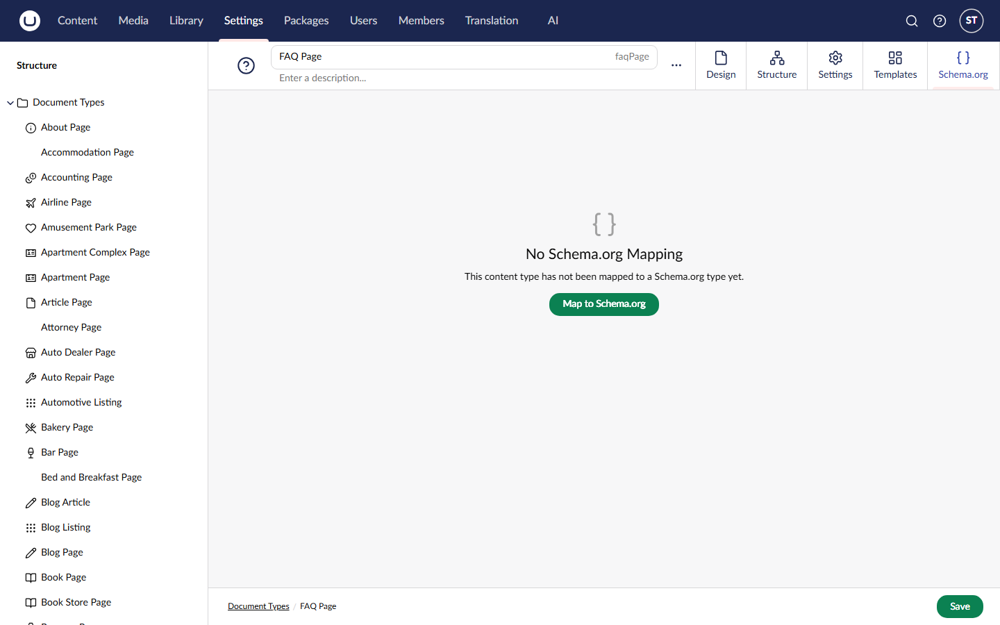
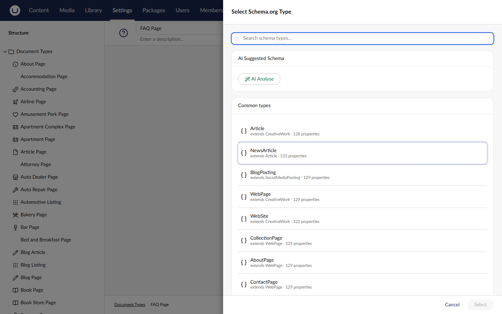
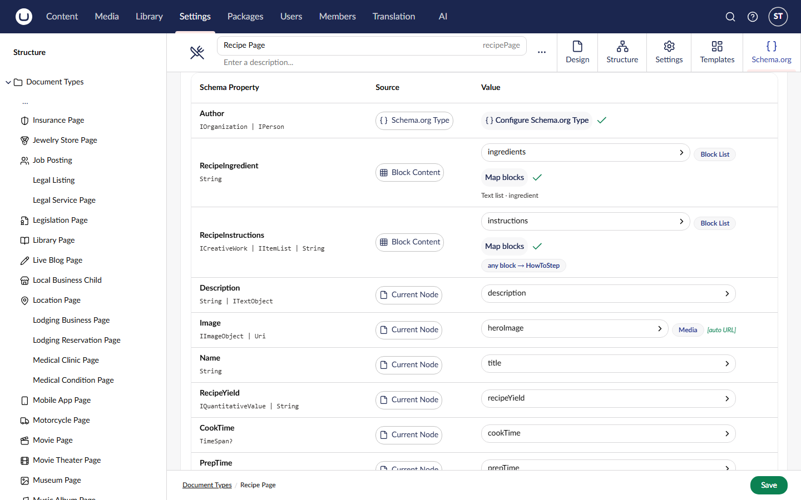

# Quick Start for SEOs

You do not need to write code to use SchemeWeaver. If it is installed on your Umbraco site, everything below happens in the backoffice.

## What SchemeWeaver does

Search engines understand pages better when the page carries structured data: a machine-readable summary saying "this page is a recipe, it takes 45 minutes, here is the rating". Structured data is what makes pages eligible for rich results: star ratings, FAQ dropdowns, recipe cards and job listings in Google.

SchemeWeaver generates that structured data (JSON-LD, the format Google recommends) automatically from your existing Umbraco content. You tell it once what each page type is and which fields matter; from then on every page of that type carries correct, up-to-date structured data, in the same connected-graph shape that tools like Yoast produce.

## Map a page type

You map page types (document types), not individual pages. Map the Blog Post type once and every blog post on the site is covered.

1. Go to **Settings**, then **Document Types**, and open the page type you care about.
2. Open the **Schema.org** tab and select **Map to Schema.org**.

3. Choose what this page type *is*. The picker suggests common types; you can search for anything. Be as specific as you can: choose `Recipe` for recipes rather than a generic article type, because specific types unlock specific rich results.

4. Select **Auto-map**. SchemeWeaver reads the type's fields and suggests which Umbraco field feeds which schema property, with a confidence tag on each row. Review the suggestions, adjust anything odd, add missing properties with the search box at the bottom, and save.

That is it. Every page of that type now carries structured data.

## Check what a page emits

Open any page of a mapped type in the **Content** section and select its **JSON-LD** tab. You will see exactly what ships on the live page, plus a validation report against Google's rich results rules:

- **Critical**: Google will likely reject the rich result. Fix these.
- **Warning**: eligible, but a recommended property is missing.
- **Info**: worth knowing, no action required.
- **Suggestion**: SchemeWeaver has spotted a way to get richer output from your existing content, for example switching a block-based field to a richer mapping mode.

For an outside opinion, paste the published page's URL into [Google's Rich Results Test](https://search.google.com/test/rich-results).

## Site-wide schema

Three things cover the whole site rather than one page type:

- **Organisation and website identity**: ask your developer to set up the site settings node (five minutes, described in the [developer quick start](quickstart-developer.md)). Once mapped, every page's structured data includes your organisation (name, logo, social profiles) and website, properly cross-linked.
- **Breadcrumbs**: generated automatically for every page. Nothing to do.
- **Inheriting a schema down a section**: the **Inherited** toggle on a mapped type's Schema.org tab outputs that schema on all pages beneath it, useful for section-wide schema.

## Which rich results can you target?

SchemeWeaver validates your output against Google's rules for these families, so the report tells you what is missing before Google does:

| You publish | Map to | Google feature |
|---|---|---|
| Articles, blog posts, news | `Article`, `BlogPosting`, `NewsArticle` | Article rich results, Top Stories eligibility |
| Products | `Product` with offers and reviews | Price, availability, stars in listings |
| Recipes | `Recipe` | Recipe cards with image, rating, cook time |
| Events | `Event` | Event listings with date and venue |
| FAQs | `FAQPage` | Expandable Q&A beneath the result |
| Step-by-step guides | `HowTo` | How-to rich results |
| Job vacancies | `JobPosting` | Google for Jobs |
| Local businesses, restaurants, hotels | `LocalBusiness` and subtypes | Knowledge panel, local pack details |
| Videos | `VideoObject` | Video rich results |
| Courses | `Course` | Course listings |
| Books, films, property listings, vehicles and more | `Book`, `Movie`, `RealEstateListing`, `Vehicle`, ... | Type-specific features |

Structured data makes pages *eligible* for rich results; Google decides when to show them. Correct markup is the part you control.

## Auditing the whole site

If your team uses an AI assistant with the [SchemeWeaver MCP server](mcp-server.md), the bundled `schemeweaver-audit` skill will walk every mapped type, validate it, and report what to improve, a full structured-data audit from one prompt.

## Next steps

- [Mapping Content Types](mapping-content-types.md): the full mapping workflow, changing a type, deleting a mapping
- [Quick Start for Developers](quickstart-developer.md): the technical half of the setup
